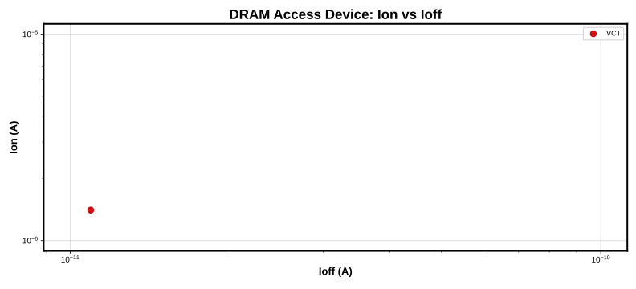
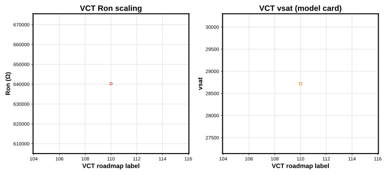
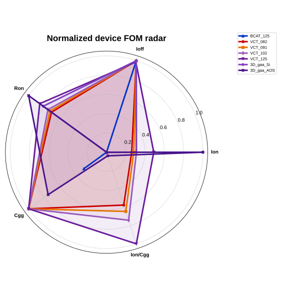
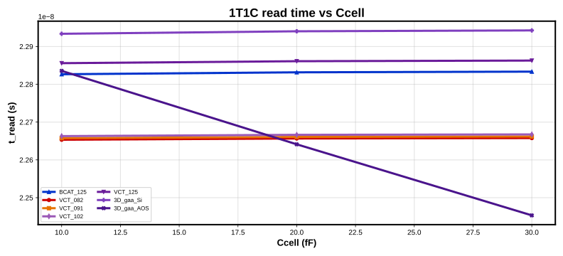

# OpenDRAMBench — Platform Results

**Generated:** 2026-06-23 06:04 UTC
**Suite:** device
**Corner scope:** tt
**Model bundle:** OpenDRAMmodelV1 `e692790da857`
**Models:** 3D_gaa_AOS, 3D_gaa_Si, BCAT_125, VCT_082, VCT_091, VCT_102, VCT_125

Reproducible benchmark automation for Open DRAM model cards (Paper A1 positioning).
This platform extends the Open DRAM Model Part I/II artifacts with push-button reruns,
multi-tool comparison, validation, and provenance manifests.
See [benchmark_spec.md](../docs/benchmark_spec.md) for metric definitions.

---

# OpenDRAM Device Benchmark — Results

**Generated:** 2026-06-23 06:04 UTC  
**Corners:** tt (reference: **tt** for tables/plots)  
**Simulator:** ngspice  
**Models:** 7 access devices  
**OpenDRAMmodelV1 revision:** `b204668`

Cross-architecture DRAM access transistor benchmark (BCAT vs VCT vs 3D GAA) using OpenDRAMmodelV1. See [benchmark_spec.md](../docs/benchmark_spec.md) for metric definitions.

## Architecture highlights (tt)

- **3D_GAA**: highest Ion = `3D_gaa_AOS` (4.534e-06 A); lowest Ioff = `3D_gaa_Si` (2.916e-14 A)
- **BCAT**: highest Ion = `BCAT_125` (5.578e-07 A); lowest Ioff = `BCAT_125` (8.684e-15 A)
- **VCT**: highest Ion = `VCT_125` (2.507e-06 A); lowest Ioff = `VCT_082` (5.944e-14 A)

## Device vs cell ranking (tt)

- **Fastest device Ion:** `3D_gaa_AOS`
- **Fastest 1T1C read (20 fF):** `3D_gaa_AOS`
- Device Ion and 1T1C read leaders align at 20 fF.

## Metric table (tt)

| Model | Architecture | Vdd (V) | Ion (A) | Ioff (A) | Vt (V) | SS (mV/dec) | DIBL (mV/V) | Ron (Ω) | Cgg (F) | Cgd (F) | GIDL (A) | Ion/Cgg (1/s) | Ron×Cload (s) | Ioff density (A/m²) |
| --- | --- | --- | --- | --- | --- | --- | --- | --- | --- | --- | --- | --- | --- | --- |
| BCAT_125 | BCAT | 0.85 | 5.578e-07 | 8.684e-15 | 0.850 | 7.7 | 5.0 | 1.524e+06 | 1.155e-17 | 1.039e-12 | 8.684e-15 | 4.828e+10 | 3.048e-08 | 4.923e+00 |
| VCT_082 | VCT | 0.90 | 1.595e-06 | 5.944e-14 | 0.900 | 7.6 | 84.9 | 5.641e+05 | 1.041e-19 | 2.785e-12 | 5.944e-14 | 1.533e+13 | 1.128e-08 | 1.651e+01 |
| VCT_091 | VCT | 0.90 | 1.680e-06 | 6.214e-14 | 0.900 | 7.6 | 85.0 | 5.358e+05 | 9.788e-20 | 2.930e-12 | 6.214e-14 | 1.716e+13 | 1.072e-08 | 1.726e+01 |
| VCT_102 | VCT | 0.90 | 1.793e-06 | 6.575e-14 | 0.900 | 7.6 | 85.3 | 5.020e+05 | 9.103e-20 | 3.125e-12 | 6.575e-14 | 1.969e+13 | 1.004e-08 | 1.826e+01 |
| VCT_125 | VCT | 0.90 | 2.507e-06 | 3.354e-13 | 0.900 | 8.2 | 84.8 | 3.590e+05 | 9.453e-20 | 4.456e-12 | 3.354e-13 | 2.652e+13 | 7.180e-09 | 9.316e+01 |
| 3D_gaa_Si | 3D_GAA | 0.75 | 1.785e-06 | 2.916e-14 | 0.750 | 7.7 | 4.9 | 4.201e+05 | 1.627e-17 | 3.322e-12 | 2.916e-14 | 1.097e+11 | 8.402e-09 | 6.025e+01 |
| 3D_gaa_AOS | 3D_GAA | 0.75 | 4.534e-06 | 2.130e-11 | 0.750 | 11.2 | 10.5 | 1.654e+05 | 4.139e-18 | 8.303e-12 | 2.130e-11 | 1.095e+12 | 3.308e-09 | 5.916e+03 |

## VCT scaling summary (tt)

| Node | Ion (A) | Ioff (A) | Ron (Ω) | vsat |
| --- | --- | --- | --- | --- |
| 082 | 1.595e-06 | 5.944e-14 | 5.641e+05 | 25420 |
| 091 | 1.680e-06 | 6.214e-14 | 5.358e+05 | 26820 |
| 102 | 1.793e-06 | 6.575e-14 | 5.020e+05 | 28720 |
| 125 | 2.507e-06 | 3.354e-13 | 3.590e+05 | 28720 |

- **082 → 125 Ion:** +57.1% (1.595e-06 → 2.507e-06 A)
- **082 → 125 Ioff:** +464.2% (5.944e-14 → 3.354e-13 A)
- **082 → 125 Ron:** -36.4% (5.641e+05 → 3.590e+05 Ω)
- Drive improves with node; Ioff rises — retention vs drive trade-off in the VCT cards.
- Full step-by-step analysis: [vct_scaling_analysis.md](../docs/vct_scaling_analysis.md)

## 1T1C macro (20 fF reference)

| Model | Ccell (fF) | t_write (s) | t_read (s) | I_hold (A) | Q_read (C) |
| --- | --- | --- | --- | --- | --- |
| BCAT_125 | 20 | 1.900e-09 | 2.283e-08 | 7.892e-12 | 3.992e-19 |
| VCT_082 | 20 | 1.900e-09 | 2.266e-08 | 3.165e-11 | 2.832e-18 |
| VCT_091 | 20 | 1.900e-09 | 2.266e-08 | 3.164e-11 | 2.797e-18 |
| VCT_102 | 20 | 1.900e-09 | 2.267e-08 | 3.162e-11 | 2.752e-18 |
| VCT_125 | 20 | 1.900e-09 | 2.286e-08 | 3.066e-11 | 1.024e-18 |
| 3D_gaa_Si | 20 | 1.900e-09 | 2.294e-08 | 2.953e-11 | 1.500e-19 |
| 3D_gaa_AOS | 20 | 1.901e-09 | 2.264e-08 | 4.506e-10 | 1.330e-19 |

## 1T1C Ccell sweep (tt)

Full transient sweep at 10, 20, and 30 fF per model.

| Model | Ccell (fF) | t_write (s) | t_read (s) | I_hold (A) | Q_read (C) |
| --- | --- | --- | --- | --- | --- |
| 3D_gaa_AOS | 10 | 1.902e-09 | 2.284e-08 | 4.505e-10 | 2.644e-19 |
| 3D_gaa_AOS | 20 | 1.901e-09 | 2.264e-08 | 4.506e-10 | 1.330e-19 |
| 3D_gaa_AOS | 30 | 1.901e-09 | 2.245e-08 | 4.506e-10 | 8.883e-20 |
| 3D_gaa_Si | 10 | 1.901e-09 | 2.293e-08 | 2.953e-11 | 1.907e-19 |
| 3D_gaa_Si | 20 | 1.900e-09 | 2.294e-08 | 2.953e-11 | 1.500e-19 |
| 3D_gaa_Si | 30 | 1.900e-09 | 2.294e-08 | 2.953e-11 | 1.364e-19 |
| BCAT_125 | 10 | 1.901e-09 | 2.283e-08 | 7.892e-12 | 4.246e-19 |
| BCAT_125 | 20 | 1.900e-09 | 2.283e-08 | 7.892e-12 | 3.992e-19 |
| BCAT_125 | 30 | 1.900e-09 | 2.283e-08 | 7.892e-12 | 3.907e-19 |
| VCT_082 | 10 | 1.901e-09 | 2.265e-08 | 3.165e-11 | 2.854e-18 |
| VCT_082 | 20 | 1.900e-09 | 2.266e-08 | 3.165e-11 | 2.832e-18 |
| VCT_082 | 30 | 1.900e-09 | 2.266e-08 | 3.166e-11 | 2.824e-18 |
| VCT_091 | 10 | 1.901e-09 | 2.266e-08 | 3.164e-11 | 2.819e-18 |
| VCT_091 | 20 | 1.900e-09 | 2.266e-08 | 3.164e-11 | 2.797e-18 |
| VCT_091 | 30 | 1.900e-09 | 2.266e-08 | 3.164e-11 | 2.789e-18 |
| VCT_102 | 10 | 1.901e-09 | 2.266e-08 | 3.162e-11 | 2.774e-18 |
| VCT_102 | 20 | 1.900e-09 | 2.267e-08 | 3.162e-11 | 2.752e-18 |
| VCT_102 | 30 | 1.900e-09 | 2.267e-08 | 3.162e-11 | 2.744e-18 |
| VCT_125 | 10 | 1.901e-09 | 2.286e-08 | 3.066e-11 | 1.060e-18 |
| VCT_125 | 20 | 1.900e-09 | 2.286e-08 | 3.066e-11 | 1.024e-18 |
| VCT_125 | 30 | 1.900e-09 | 2.286e-08 | 3.066e-11 | 1.012e-18 |

## Mini-array (layout BL RC)

| Model | N cells | BL topology | t_BL settle (s) | I_BL leak (A) | R_metal/pitch (Ω) | R_contact (Ω) | C_SA (fF) |
| --- | --- | --- | --- | --- | --- | --- | --- |
| BCAT_125 | 8 | layout | 6.009e-09 | 2.495e-10 | 3.50 | 2.86 | 21.0 |
| VCT_082 | 8 | layout | 5.233e-09 | 1.557e-10 | 5.00 | 2.00 | 30.0 |
| VCT_091 | 8 | layout | 5.069e-09 | 1.581e-10 | 5.00 | 2.00 | 30.0 |
| VCT_102 | 8 | layout | 4.874e-09 | 1.612e-10 | 5.00 | 2.00 | 30.0 |
| VCT_125 | 8 | layout | 3.638e-09 | 2.255e-10 | 5.00 | 2.00 | 30.0 |
| 3D_gaa_Si | 8 | layout | 2.363e-09 | 6.962e-10 | 1.83 | 5.45 | 11.0 |
| 3D_gaa_AOS | 8 | layout | 2.460e-09 | 2.525e-10 | 5.00 | 2.00 | 30.0 |

## Summary figures

### Pareto Ion Ioff

### Vct Scaling

### Radar Fom

### Ccell Scaling

## Artifacts

| File | Description |
|------|-------------|
| `device_metrics.csv` | Device metrics (CSV) |
| `cell_1t1c_metrics_all_corners.csv` | 1T1C sweep (all corners, when present) |
| `mini_array_metrics_all_corners.csv` | Mini-array (all corners, when present) |
| `figures/` | Pareto, VCT scaling, radar, corner sensitivity, Ccell scaling |
| `../docs/vct_scaling_analysis.md` | VCT node scaling write-up |

---
*Report produced by `dram-device report` / `run_experiments.sh`*
