# OpenDRAMBench — Aggregate Results

Self-contained benchmark automation for Open DRAM Model cards. Full per-suite reports are inlined below; each lane also keeps its own suite-level `RESULTS.md` for direct linking.

## Run summary

| Field | Value |
|-------|-------|
| Suite | `all` |
| Corner | `tt` |
| Simulator | ngspice, spectre |
| Generated | 2026-06-23 16:05 UTC |
| Status | complete |
| Model bundle | OpenDRAMmodelV1 `e692790da857` |

## Contents

- [Suite index](#suite-index)
- [Suite: device](#suite-device)
- [Suite: corner_sweep](#suite-corner_sweep)
- [Suite: multi_tool](#suite-multi_tool)
- [Suite: sense_amp](#suite-sense_amp)
- [Suite: ccell](#suite-ccell)
- [Suite: validation](#suite-validation)
- [Artifacts](#artifacts)
- [Reproduce](#reproduce)

---
## Suite index

| Suite | Role | Status | Detail |
|-------|------|--------|--------|
| `device` | Full access-device + 1T1C + mini-array @ TT | ready | [device/RESULTS.md](device/RESULTS.md) |
| `corner_sweep` | Six-corner PVT matrix (device + 1T1C + mini-array) | ready | [corner_sweep/RESULTS.md](corner_sweep/RESULTS.md) |
| `multi_tool` | Cross-simulator agreement | ready | [multi_tool/RESULTS.md](multi_tool/RESULTS.md) |
| `sense_amp` | Read-path ΔV_BL + derived SA requirements | ready | [sense_amp/RESULTS.md](sense_amp/RESULTS.md) |
| `ccell` | Ccell retention vs read binding | ready | [ccell/RESULTS.md](ccell/RESULTS.md) |
| `validation` | Golden + literature + paper audit | ready | [validation/RESULTS.md](validation/RESULTS.md) |

---

## Suite: device

Detail report: [device/RESULTS.md](device/RESULTS.md)

### Device benchmark

**Generated:** 2026-06-23 16:04 UTC  
**Corners:** tt (reference: **tt** for tables/plots)  
**Simulator:** spectre  
**Models:** 7 access devices  
**OpenDRAMmodelV1 revision:** `416f124`

Cross-architecture DRAM access transistor benchmark (BCAT vs VCT vs 3D GAA) using OpenDRAMmodelV1.

### Executive summary

- **Highest Ion:** `3D_gaa_AOS` (1.885e-06 A)
- **Lowest Ioff:** `3D_gaa_Si` (1.011e-14 A)
- **Fastest 1T1C read @ 20 fF:** `3D_gaa_AOS` (2.257e-08 s)

### Architecture highlights (tt)

- **3D_GAA**: highest Ion = `3D_gaa_AOS` (1.885e-06 A); lowest Ioff = `3D_gaa_Si` (1.011e-14 A)
- **BCAT**: highest Ion = `BCAT_125` (3.024e-07 A); lowest Ioff = `BCAT_125` (6.143e-14 A)
- **VCT**: highest Ion = `VCT_125` (1.406e-06 A); lowest Ioff = `VCT_082` (3.731e-12 A)

### Device vs cell ranking (tt)

- **Fastest device Ion:** `3D_gaa_AOS`
- **Fastest 1T1C read (20 fF):** `3D_gaa_AOS`
- Device Ion and 1T1C read leaders align at 20 fF.

### Metric table (tt)

| Model | Architecture | Vdd (V) | Ion (A) | Ioff (A) | Vt (V) | SS (mV/dec) | DIBL (mV/V) | Ron (Ω) | Cgg (F) | Cgd (F) | GIDL (A) | Ion/Cgg (1/s) | Ron×Cload (s) | Ioff density (A/m²) |
| --- | --- | --- | --- | --- | --- | --- | --- | --- | --- | --- | --- | --- | --- | --- |
| BCAT_125 | BCAT | 0.85 | 3.024e-07 | 6.143e-14 | 0.850 | 9.0 | 7.8 | 2.811e+06 | 4.726e-17 | 5.495e-13 | 6.143e-14 | 6.398e+09 | 5.622e-08 | 3.482e+01 |
| VCT_082 | VCT | 0.90 | 9.285e-07 | 3.731e-12 | 0.900 | 10.3 | 130.1 | 9.693e+05 | 1.216e-17 | 1.522e-12 | 3.731e-12 | 7.638e+10 | 1.939e-08 | 1.036e+03 |
| VCT_091 | VCT | 0.90 | 9.742e-07 | 3.877e-12 | 0.900 | 10.3 | 130.6 | 9.238e+05 | 1.217e-17 | 1.595e-12 | 3.877e-12 | 8.004e+10 | 1.848e-08 | 1.077e+03 |
| VCT_102 | VCT | 0.90 | 1.035e-06 | 4.067e-12 | 0.900 | 10.3 | 131.3 | 8.695e+05 | 1.219e-17 | 1.691e-12 | 4.067e-12 | 8.493e+10 | 1.739e-08 | 1.130e+03 |
| VCT_125 | VCT | 0.90 | 1.406e-06 | 1.093e-11 | 0.900 | 10.8 | 129.2 | 6.403e+05 | 1.244e-17 | 2.363e-12 | 1.093e-11 | 1.130e+11 | 1.281e-08 | 3.036e+03 |
| 3D_gaa_Si | 3D_GAA | 0.75 | 1.041e-06 | 1.011e-14 | 0.750 | 7.5 | 6.2 | 7.207e+05 | 1.663e-16 | 1.899e-12 | 1.011e-14 | 6.260e+09 | 1.441e-08 | 2.088e+01 |
| 3D_gaa_AOS | 3D_GAA | 0.75 | 1.885e-06 | 8.455e-11 | 0.750 | 13.8 | 18.9 | 3.978e+05 | 7.082e-17 | 3.311e-12 | 8.455e-11 | 2.662e+10 | 7.956e-09 | 2.349e+04 |

### VCT scaling summary (tt)

| Node | Ion (A) | Ioff (A) | Ron (Ω) | vsat |
| --- | --- | --- | --- | --- |
| 082 | 9.285e-07 | 3.731e-12 | 9.693e+05 | 25420 |
| 091 | 9.742e-07 | 3.877e-12 | 9.238e+05 | 26820 |
| 102 | 1.035e-06 | 4.067e-12 | 8.695e+05 | 28720 |
| 125 | 1.406e-06 | 1.093e-11 | 6.403e+05 | 28720 |

- **082 → 125 Ion:** +51.4% (9.285e-07 → 1.406e-06 A)
- **082 → 125 Ioff:** +192.9% (3.731e-12 → 1.093e-11 A)
- **082 → 125 Ron:** -33.9% (9.693e+05 → 6.403e+05 Ω)
- Drive improves with node; Ioff rises — retention vs drive trade-off in the VCT cards.
- Full step-by-step analysis: [vct_scaling_analysis.md](../docs/vct_scaling_analysis.md)

### 1T1C macro (20 fF reference)

| Model | Ccell (fF) | t_write (s) | t_read (s) | I_hold (A) | Q_read (C) |
| --- | --- | --- | --- | --- | --- |
| BCAT_125 | 20 | 1.900e-09 | 2.272e-08 | 8.384e-14 | 1.418e-19 |
| VCT_082 | 20 | 1.900e-09 | 2.282e-08 | 6.021e-11 | 2.138e-18 |
| VCT_091 | 20 | 1.900e-09 | 2.282e-08 | 6.016e-11 | 2.095e-18 |
| VCT_102 | 20 | 1.900e-09 | 2.283e-08 | 6.009e-11 | 2.041e-18 |
| VCT_125 | 20 | 1.900e-09 | 2.293e-08 | 5.757e-11 | 7.505e-19 |
| 3D_gaa_Si | 20 | 1.900e-09 | 2.291e-08 | 1.672e-11 | 3.586e-19 |
| 3D_gaa_AOS | 20 | 1.901e-09 | 2.257e-08 | 3.455e-10 | 1.529e-19 |

### 1T1C Ccell sweep (tt)

Full transient sweep at 10, 20, and 30 fF per model.

| Model | Ccell (fF) | t_write (s) | t_read (s) | I_hold (A) | Q_read (C) |
| --- | --- | --- | --- | --- | --- |
| 3D_gaa_AOS | 10 | 1.902e-09 | 2.278e-08 | 3.454e-10 | 2.749e-19 |
| 3D_gaa_AOS | 20 | 1.901e-09 | 2.257e-08 | 3.455e-10 | 1.529e-19 |
| 3D_gaa_AOS | 30 | 1.901e-09 | 2.238e-08 | 3.455e-10 | 1.119e-19 |
| 3D_gaa_Si | 10 | 1.901e-09 | 2.290e-08 | 1.671e-11 | 3.936e-19 |
| 3D_gaa_Si | 20 | 1.900e-09 | 2.291e-08 | 1.672e-11 | 3.586e-19 |
| 3D_gaa_Si | 30 | 1.900e-09 | 2.291e-08 | 1.672e-11 | 3.468e-19 |
| BCAT_125 | 10 | 1.900e-09 | 2.271e-08 | 8.340e-14 | 1.555e-19 |
| BCAT_125 | 20 | 1.900e-09 | 2.272e-08 | 8.384e-14 | 1.418e-19 |
| BCAT_125 | 30 | 1.900e-09 | 2.272e-08 | 8.399e-14 | 1.372e-19 |
| VCT_082 | 10 | 1.901e-09 | 2.281e-08 | 6.020e-11 | 2.174e-18 |
| VCT_082 | 20 | 1.900e-09 | 2.282e-08 | 6.021e-11 | 2.138e-18 |
| VCT_082 | 30 | 1.900e-09 | 2.282e-08 | 6.021e-11 | 2.125e-18 |
| VCT_091 | 10 | 1.901e-09 | 2.282e-08 | 6.015e-11 | 2.131e-18 |
| VCT_091 | 20 | 1.900e-09 | 2.282e-08 | 6.016e-11 | 2.095e-18 |
| VCT_091 | 30 | 1.900e-09 | 2.282e-08 | 6.016e-11 | 2.082e-18 |
| VCT_102 | 10 | 1.901e-09 | 2.282e-08 | 6.008e-11 | 2.078e-18 |
| VCT_102 | 20 | 1.900e-09 | 2.283e-08 | 6.009e-11 | 2.041e-18 |
| VCT_102 | 30 | 1.900e-09 | 2.283e-08 | 6.009e-11 | 2.029e-18 |
| VCT_125 | 10 | 1.901e-09 | 2.292e-08 | 5.758e-11 | 7.961e-19 |
| VCT_125 | 20 | 1.900e-09 | 2.293e-08 | 5.757e-11 | 7.505e-19 |
| VCT_125 | 30 | 1.900e-09 | 2.293e-08 | 5.760e-11 | 7.350e-19 |

### Mini-array (layout BL RC)

| Model | N cells | BL topology | t_BL settle (s) | I_BL leak (A) | R_metal/pitch (Ω) | R_contact (Ω) | C_SA (fF) |
| --- | --- | --- | --- | --- | --- | --- | --- |
| BCAT_125 | 8 | layout | 9.939e-09 | 1.399e-10 | 3.50 | 2.86 | 21.0 |
| VCT_082 | 8 | layout | 7.753e-09 | 1.331e-10 | 5.00 | 2.00 | 30.0 |
| VCT_091 | 8 | layout | 7.498e-09 | 1.362e-10 | 5.00 | 2.00 | 30.0 |
| VCT_102 | 8 | layout | 7.196e-09 | 1.399e-10 | 5.00 | 2.00 | 30.0 |
| VCT_125 | 8 | layout | 5.235e-09 | 1.951e-10 | 5.00 | 2.00 | 30.0 |
| 3D_gaa_Si | 8 | layout | 2.810e-09 | 6.220e-10 | 1.83 | 5.45 | 11.0 |
| 3D_gaa_AOS | 8 | layout | 3.642e-09 | 2.348e-10 | 5.00 | 2.00 | 30.0 |

### Summary figures

#### Pareto: Ion vs Ioff

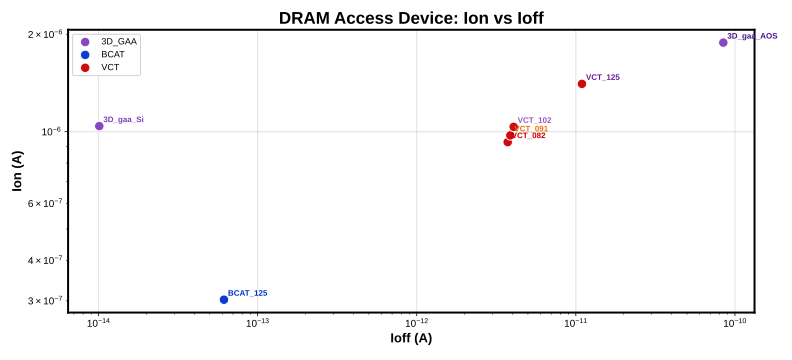

#### VCT node scaling

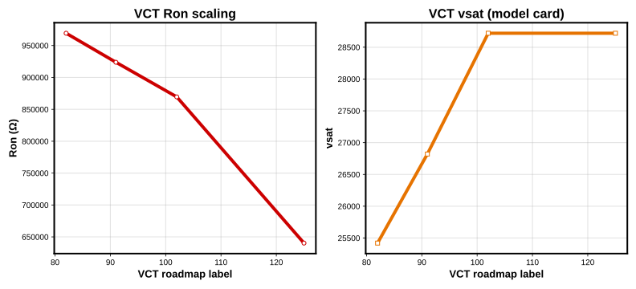

#### Composite figure of merit

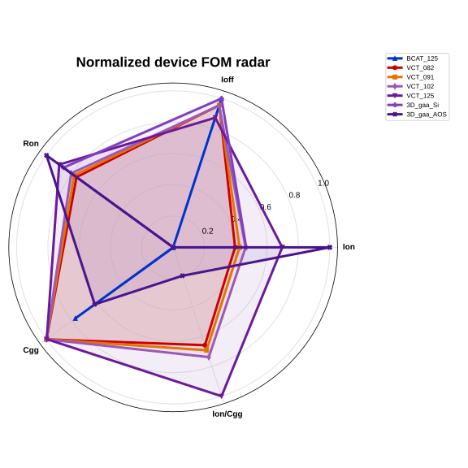

#### 1T1C read time vs Ccell

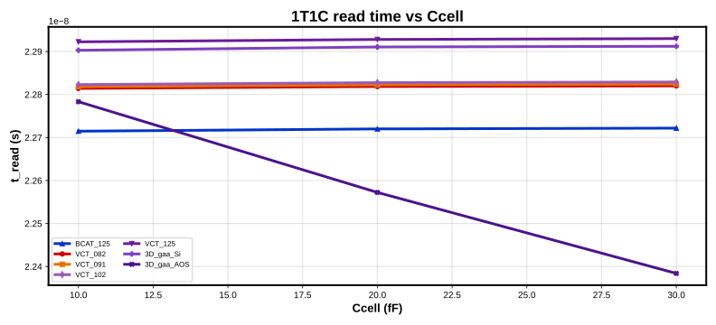

---

## Suite: corner_sweep

Detail report: [corner_sweep/RESULTS.md](corner_sweep/RESULTS.md)

### Device benchmark

**Generated:** 2026-06-23 16:04 UTC  
**Corners:** all (reference: **tt** for tables/plots)  
**Simulator:** spectre  
**Models:** 7 access devices  
**OpenDRAMmodelV1 revision:** `416f124`

Cross-architecture DRAM access transistor benchmark (BCAT vs VCT vs 3D GAA) using OpenDRAMmodelV1.

### Executive summary

- **Highest Ion:** `3D_gaa_AOS` (1.885e-06 A)
- **Lowest Ioff:** `3D_gaa_Si` (1.011e-14 A)
- **Fastest 1T1C read @ 20 fF:** `3D_gaa_AOS` (2.257e-08 s)

### Corner matrix summary

Primary tables and Pareto/VCT/radar plots use **tt** reference data.

| Corner | Mean Ion (A) | Mean Ioff (A) | Max Ion model |
| --- | --- | --- | --- |
| cold | 8.472e-07 | 1.631e-12 | `3D_gaa_AOS` (1.676e-06 A) |
| ff | 1.491e-06 | 1.644e-11 | `3D_gaa_AOS` (2.484e-06 A) |
| hot | 1.318e-06 | 7.883e-11 | `3D_gaa_AOS` (2.039e-06 A) |
| ss | 7.208e-07 | 1.433e-11 | `3D_gaa_AOS` (1.358e-06 A) |
| ss_125 | 1.060e-06 | 1.937e-10 | `3D_gaa_AOS` (1.571e-06 A) |
| tt | 1.082e-06 | 1.532e-11 | `3D_gaa_AOS` (1.885e-06 A) |

### Architecture highlights (tt)

- **3D_GAA**: highest Ion = `3D_gaa_AOS` (1.885e-06 A); lowest Ioff = `3D_gaa_Si` (1.011e-14 A)
- **BCAT**: highest Ion = `BCAT_125` (3.024e-07 A); lowest Ioff = `BCAT_125` (6.143e-14 A)
- **VCT**: highest Ion = `VCT_125` (1.406e-06 A); lowest Ioff = `VCT_082` (3.731e-12 A)

### Device vs cell ranking (tt)

- **Fastest device Ion:** `3D_gaa_AOS`
- **Fastest 1T1C read (20 fF):** `3D_gaa_AOS`
- Device Ion and 1T1C read leaders align at 20 fF.

### Metric table (tt)

| Model | Architecture | Vdd (V) | Ion (A) | Ioff (A) | Vt (V) | SS (mV/dec) | DIBL (mV/V) | Ron (Ω) | Cgg (F) | Cgd (F) | GIDL (A) | Ion/Cgg (1/s) | Ron×Cload (s) | Ioff density (A/m²) |
| --- | --- | --- | --- | --- | --- | --- | --- | --- | --- | --- | --- | --- | --- | --- |
| BCAT_125 | BCAT | 0.85 | 3.024e-07 | 6.143e-14 | 0.850 | 9.0 | 7.8 | 2.811e+06 | 4.726e-17 | 5.495e-13 | 6.143e-14 | 6.398e+09 | 5.622e-08 | 3.482e+01 |
| VCT_082 | VCT | 0.90 | 9.285e-07 | 3.731e-12 | 0.900 | 10.3 | 130.1 | 9.693e+05 | 1.216e-17 | 1.522e-12 | 3.731e-12 | 7.638e+10 | 1.939e-08 | 1.036e+03 |
| VCT_091 | VCT | 0.90 | 9.742e-07 | 3.877e-12 | 0.900 | 10.3 | 130.6 | 9.238e+05 | 1.217e-17 | 1.595e-12 | 3.877e-12 | 8.004e+10 | 1.848e-08 | 1.077e+03 |
| VCT_102 | VCT | 0.90 | 1.035e-06 | 4.067e-12 | 0.900 | 10.3 | 131.3 | 8.695e+05 | 1.219e-17 | 1.691e-12 | 4.067e-12 | 8.493e+10 | 1.739e-08 | 1.130e+03 |
| VCT_125 | VCT | 0.90 | 1.406e-06 | 1.093e-11 | 0.900 | 10.8 | 129.2 | 6.403e+05 | 1.244e-17 | 2.363e-12 | 1.093e-11 | 1.130e+11 | 1.281e-08 | 3.036e+03 |
| 3D_gaa_Si | 3D_GAA | 0.75 | 1.041e-06 | 1.011e-14 | 0.750 | 7.5 | 6.2 | 7.207e+05 | 1.663e-16 | 1.899e-12 | 1.011e-14 | 6.260e+09 | 1.441e-08 | 2.088e+01 |
| 3D_gaa_AOS | 3D_GAA | 0.75 | 1.885e-06 | 8.455e-11 | 0.750 | 13.8 | 18.9 | 3.978e+05 | 7.082e-17 | 3.311e-12 | 8.455e-11 | 2.662e+10 | 7.956e-09 | 2.349e+04 |

### VCT scaling summary (tt)

| Node | Ion (A) | Ioff (A) | Ron (Ω) | vsat |
| --- | --- | --- | --- | --- |
| 082 | 9.285e-07 | 3.731e-12 | 9.693e+05 | 25420 |
| 091 | 9.742e-07 | 3.877e-12 | 9.238e+05 | 26820 |
| 102 | 1.035e-06 | 4.067e-12 | 8.695e+05 | 28720 |
| 125 | 1.406e-06 | 1.093e-11 | 6.403e+05 | 28720 |

- **082 → 125 Ion:** +51.4% (9.285e-07 → 1.406e-06 A)
- **082 → 125 Ioff:** +192.9% (3.731e-12 → 1.093e-11 A)
- **082 → 125 Ron:** -33.9% (9.693e+05 → 6.403e+05 Ω)
- Drive improves with node; Ioff rises — retention vs drive trade-off in the VCT cards.
- Full step-by-step analysis: [vct_scaling_analysis.md](../docs/vct_scaling_analysis.md)

### 1T1C macro (20 fF reference)

| Model | Ccell (fF) | t_write (s) | t_read (s) | I_hold (A) | Q_read (C) |
| --- | --- | --- | --- | --- | --- |
| BCAT_125 | 20 | 1.900e-09 | 2.272e-08 | 8.384e-14 | 1.418e-19 |
| VCT_082 | 20 | 1.900e-09 | 2.282e-08 | 6.021e-11 | 2.138e-18 |
| VCT_091 | 20 | 1.900e-09 | 2.282e-08 | 6.016e-11 | 2.095e-18 |
| VCT_102 | 20 | 1.900e-09 | 2.283e-08 | 6.009e-11 | 2.041e-18 |
| VCT_125 | 20 | 1.900e-09 | 2.293e-08 | 5.757e-11 | 7.505e-19 |
| 3D_gaa_Si | 20 | 1.900e-09 | 2.291e-08 | 1.672e-11 | 3.586e-19 |
| 3D_gaa_AOS | 20 | 1.901e-09 | 2.257e-08 | 3.455e-10 | 1.529e-19 |

### 1T1C Ccell sweep (tt)

Full transient sweep at 10, 20, and 30 fF per model.

| Model | Ccell (fF) | t_write (s) | t_read (s) | I_hold (A) | Q_read (C) |
| --- | --- | --- | --- | --- | --- |
| 3D_gaa_AOS | 10 | 1.902e-09 | 2.278e-08 | 3.454e-10 | 2.749e-19 |
| 3D_gaa_AOS | 20 | 1.901e-09 | 2.257e-08 | 3.455e-10 | 1.529e-19 |
| 3D_gaa_AOS | 30 | 1.901e-09 | 2.238e-08 | 3.455e-10 | 1.119e-19 |
| 3D_gaa_Si | 10 | 1.901e-09 | 2.290e-08 | 1.671e-11 | 3.936e-19 |
| 3D_gaa_Si | 20 | 1.900e-09 | 2.291e-08 | 1.672e-11 | 3.586e-19 |
| 3D_gaa_Si | 30 | 1.900e-09 | 2.291e-08 | 1.672e-11 | 3.468e-19 |
| BCAT_125 | 10 | 1.900e-09 | 2.271e-08 | 8.340e-14 | 1.555e-19 |
| BCAT_125 | 20 | 1.900e-09 | 2.272e-08 | 8.384e-14 | 1.418e-19 |
| BCAT_125 | 30 | 1.900e-09 | 2.272e-08 | 8.399e-14 | 1.372e-19 |
| VCT_082 | 10 | 1.901e-09 | 2.281e-08 | 6.020e-11 | 2.174e-18 |
| VCT_082 | 20 | 1.900e-09 | 2.282e-08 | 6.021e-11 | 2.138e-18 |
| VCT_082 | 30 | 1.900e-09 | 2.282e-08 | 6.021e-11 | 2.125e-18 |
| VCT_091 | 10 | 1.901e-09 | 2.282e-08 | 6.015e-11 | 2.131e-18 |
| VCT_091 | 20 | 1.900e-09 | 2.282e-08 | 6.016e-11 | 2.095e-18 |
| VCT_091 | 30 | 1.900e-09 | 2.282e-08 | 6.016e-11 | 2.082e-18 |
| VCT_102 | 10 | 1.901e-09 | 2.282e-08 | 6.008e-11 | 2.078e-18 |
| VCT_102 | 20 | 1.900e-09 | 2.283e-08 | 6.009e-11 | 2.041e-18 |
| VCT_102 | 30 | 1.900e-09 | 2.283e-08 | 6.009e-11 | 2.029e-18 |
| VCT_125 | 10 | 1.901e-09 | 2.292e-08 | 5.758e-11 | 7.961e-19 |
| VCT_125 | 20 | 1.900e-09 | 2.293e-08 | 5.757e-11 | 7.505e-19 |
| VCT_125 | 30 | 1.900e-09 | 2.293e-08 | 5.760e-11 | 7.350e-19 |

### Mini-array (layout BL RC)

| Model | N cells | BL topology | t_BL settle (s) | I_BL leak (A) | R_metal/pitch (Ω) | R_contact (Ω) | C_SA (fF) |
| --- | --- | --- | --- | --- | --- | --- | --- |
| BCAT_125 | 8 | layout | 9.939e-09 | 1.399e-10 | 3.50 | 2.86 | 21.0 |
| VCT_082 | 8 | layout | 7.753e-09 | 1.331e-10 | 5.00 | 2.00 | 30.0 |
| VCT_091 | 8 | layout | 7.498e-09 | 1.362e-10 | 5.00 | 2.00 | 30.0 |
| VCT_102 | 8 | layout | 7.196e-09 | 1.399e-10 | 5.00 | 2.00 | 30.0 |
| VCT_125 | 8 | layout | 5.235e-09 | 1.951e-10 | 5.00 | 2.00 | 30.0 |
| 3D_gaa_Si | 8 | layout | 2.810e-09 | 6.220e-10 | 1.83 | 5.45 | 11.0 |
| 3D_gaa_AOS | 8 | layout | 3.642e-09 | 2.348e-10 | 5.00 | 2.00 | 30.0 |

### Summary figures

#### Pareto: Ion vs Ioff


#### VCT node scaling

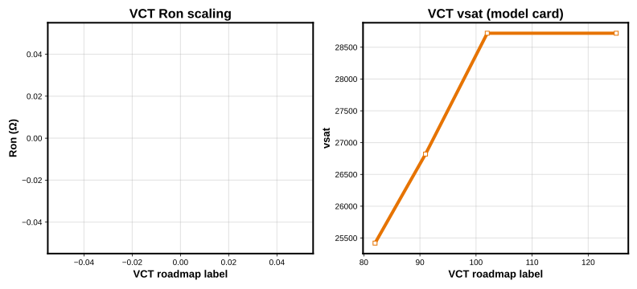

#### Composite figure of merit

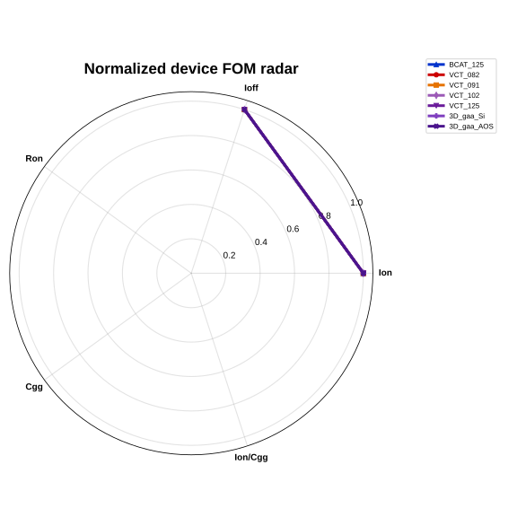

#### Corner Sensitivity Ion

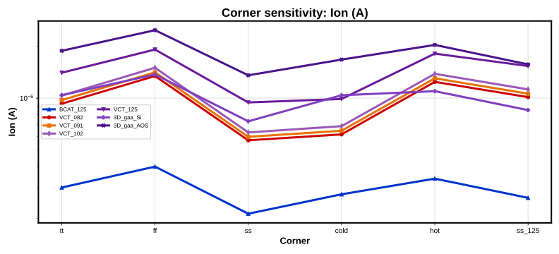

#### Corner Sensitivity Ioff

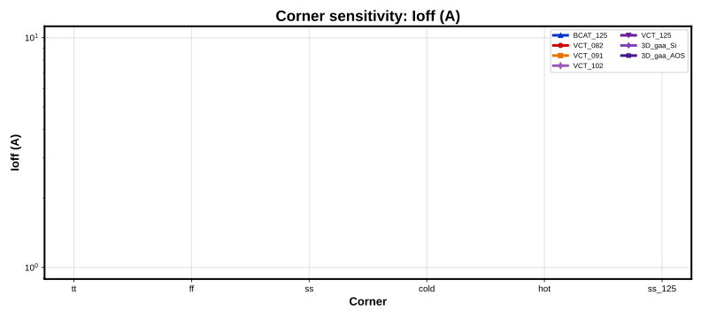

#### 1T1C read time vs Ccell

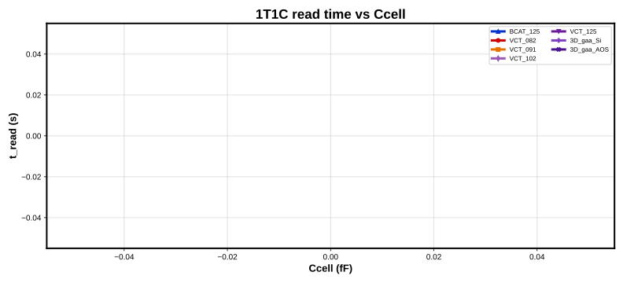

---

## Suite: multi_tool

Detail report: [multi_tool/RESULTS.md](multi_tool/RESULTS.md)

### Device benchmark

**Generated:** 2026-06-23 16:04 UTC  
**Corners:** tt (reference: **tt** for tables/plots)  
**Simulator:** spectre  
**Models:** 7 access devices  
**OpenDRAMmodelV1 revision:** `416f124`

Cross-architecture DRAM access transistor benchmark (BCAT vs VCT vs 3D GAA) using OpenDRAMmodelV1.

### Executive summary

- **Highest Ion:** `3D_gaa_AOS` (1.885e-06 A)
- **Lowest Ioff:** `3D_gaa_Si` (1.011e-14 A)
- **Fastest 1T1C read @ 20 fF:** `3D_gaa_AOS` (2.257e-08 s)
### Simulator cross-check

Relative differences vs **Spectre** when present. No golden baselines for cross-tool agreement.

Interpretation guide: [docs/simulator_cross_check.md](multi_tool/docs/simulator_cross_check.md)

**Compared backends:** ngspice, spectre

#### Max |relative difference| (tt, device metrics)

| Comparison | Max |rel diff| |
| --- | --- |
| cgd f ngspice vs spectre | 1.507 |
| cgg f ngspice vs spectre | 0.9925 |
| dibl mv v ngspice vs spectre | 0.4442 |
| esw j ngspice vs spectre | 0.2068 |
| igidl a ngspice vs spectre | 1.885 |
| ioff a ngspice vs spectre | 1.885 |
| ioff density a m2 ngspice vs spectre | 1.885 |
| ion a ngspice vs spectre | 1.405 |
| ion per cgg ngspice vs spectre | 233.8 |
| ron boost ohm ngspice vs spectre | 0.5511 |
| ron ohm ngspice vs spectre | 0.5842 |
| ron x cload ngspice vs spectre | 0.5842 |
| ss mv dec ngspice vs spectre | 0.2605 |
| vt v ngspice vs spectre | 0 |

#### Ion / Ioff by simulator (tt)

| Model | ngspice | spectre | ioff_ngspice | ioff_spectre |
| --- | --- | --- | --- | --- |
| 3D_gaa_AOS | 4.534e-06 | 1.885e-06 | 2.130e-11 | 8.455e-11 |
| 3D_gaa_Si | 1.785e-06 | 1.041e-06 | 2.916e-14 | 1.011e-14 |
| BCAT_125 | 5.578e-07 | 3.024e-07 | 8.684e-15 | 6.143e-14 |
| VCT_082 | 1.595e-06 | 9.285e-07 | 5.944e-14 | 3.731e-12 |
| VCT_091 | 1.680e-06 | 9.742e-07 | 6.214e-14 | 3.877e-12 |
| VCT_102 | 1.793e-06 | 1.035e-06 | 6.575e-14 | 4.067e-12 |
| VCT_125 | 2.507e-06 | 1.406e-06 | 3.354e-13 | 1.093e-11 |

#### Documented outliers (tt)

- `VCT_125` `ion_a` (ngspice): ngspice OSDI often reports higher Ion than Spectre; Ron follows V/I and is lower. Directional use only.
- `VCT_125` `ron_ohm` (ngspice): ngspice OSDI often reports higher Ion than Spectre; Ron follows V/I and is lower. Directional use only.
- `VCT_125` `ron_boost_ohm` (ngspice): ngspice OSDI often reports higher Ion than Spectre; Ron follows V/I and is lower. Directional use only.
- `VCT_125` `cgg_f` (ngspice): Capacitance from transient qg/qd integration on OSDI VA model; stripped HSPICE-only cap flags — often much lower than Spectre.
- `VCT_125` `cgd_f` (ngspice): Capacitance from transient qg/qd integration on OSDI VA model; stripped HSPICE-only cap flags — often much lower than Spectre.
- `VCT_125` `ion_per_cgg` (ngspice): Capacitance from transient qg/qd integration on OSDI VA model; stripped HSPICE-only cap flags — often much lower than Spectre.
- `VCT_125` `t_bl_settle_s` (ngspice): Transient timestep and OSDI trajectory vs Spectre (~35–40% @ tt).

#### Comparison artifacts

- [`simulator_compare/tt/SIMULATOR_COMPARE.md`](multi_tool/simulator_compare/tt/SIMULATOR_COMPARE.md)
- `simulator_compare/tt/device_metrics_wide.csv`
- `simulator_compare/tt/device_metrics_rel_diff.csv`

### Architecture highlights (tt)

- **3D_GAA**: highest Ion = `3D_gaa_AOS` (1.885e-06 A); lowest Ioff = `3D_gaa_Si` (1.011e-14 A)
- **BCAT**: highest Ion = `BCAT_125` (3.024e-07 A); lowest Ioff = `BCAT_125` (6.143e-14 A)
- **VCT**: highest Ion = `VCT_125` (1.406e-06 A); lowest Ioff = `VCT_082` (3.731e-12 A)

### Device vs cell ranking (tt)

- **Fastest device Ion:** `3D_gaa_AOS`
- **Fastest 1T1C read (20 fF):** `3D_gaa_AOS`
- Device Ion and 1T1C read leaders align at 20 fF.

### Metric table (tt)

| Model | Architecture | Vdd (V) | Ion (A) | Ioff (A) | Vt (V) | SS (mV/dec) | DIBL (mV/V) | Ron (Ω) | Cgg (F) | Cgd (F) | GIDL (A) | Ion/Cgg (1/s) | Ron×Cload (s) | Ioff density (A/m²) |
| --- | --- | --- | --- | --- | --- | --- | --- | --- | --- | --- | --- | --- | --- | --- |
| BCAT_125 | BCAT | 0.85 | 3.024e-07 | 6.143e-14 | 0.850 | 9.0 | 7.8 | 2.811e+06 | 4.726e-17 | 5.495e-13 | 6.143e-14 | 6.398e+09 | 5.622e-08 | 3.482e+01 |
| VCT_082 | VCT | 0.90 | 9.285e-07 | 3.731e-12 | 0.900 | 10.3 | 130.1 | 9.693e+05 | 1.216e-17 | 1.522e-12 | 3.731e-12 | 7.638e+10 | 1.939e-08 | 1.036e+03 |
| VCT_091 | VCT | 0.90 | 9.742e-07 | 3.877e-12 | 0.900 | 10.3 | 130.6 | 9.238e+05 | 1.217e-17 | 1.595e-12 | 3.877e-12 | 8.004e+10 | 1.848e-08 | 1.077e+03 |
| VCT_102 | VCT | 0.90 | 1.035e-06 | 4.067e-12 | 0.900 | 10.3 | 131.3 | 8.695e+05 | 1.219e-17 | 1.691e-12 | 4.067e-12 | 8.493e+10 | 1.739e-08 | 1.130e+03 |
| VCT_125 | VCT | 0.90 | 1.406e-06 | 1.093e-11 | 0.900 | 10.8 | 129.2 | 6.403e+05 | 1.244e-17 | 2.363e-12 | 1.093e-11 | 1.130e+11 | 1.281e-08 | 3.036e+03 |
| 3D_gaa_Si | 3D_GAA | 0.75 | 1.041e-06 | 1.011e-14 | 0.750 | 7.5 | 6.2 | 7.207e+05 | 1.663e-16 | 1.899e-12 | 1.011e-14 | 6.260e+09 | 1.441e-08 | 2.088e+01 |
| 3D_gaa_AOS | 3D_GAA | 0.75 | 1.885e-06 | 8.455e-11 | 0.750 | 13.8 | 18.9 | 3.978e+05 | 7.082e-17 | 3.311e-12 | 8.455e-11 | 2.662e+10 | 7.956e-09 | 2.349e+04 |

### VCT scaling summary (tt)

| Node | Ion (A) | Ioff (A) | Ron (Ω) | vsat |
| --- | --- | --- | --- | --- |
| 082 | 9.285e-07 | 3.731e-12 | 9.693e+05 | 25420 |
| 091 | 9.742e-07 | 3.877e-12 | 9.238e+05 | 26820 |
| 102 | 1.035e-06 | 4.067e-12 | 8.695e+05 | 28720 |
| 125 | 1.406e-06 | 1.093e-11 | 6.403e+05 | 28720 |

- **082 → 125 Ion:** +51.4% (9.285e-07 → 1.406e-06 A)
- **082 → 125 Ioff:** +192.9% (3.731e-12 → 1.093e-11 A)
- **082 → 125 Ron:** -33.9% (9.693e+05 → 6.403e+05 Ω)
- Drive improves with node; Ioff rises — retention vs drive trade-off in the VCT cards.
- Full step-by-step analysis: [vct_scaling_analysis.md](../docs/vct_scaling_analysis.md)

### 1T1C macro (20 fF reference)

| Model | Ccell (fF) | t_write (s) | t_read (s) | I_hold (A) | Q_read (C) |
| --- | --- | --- | --- | --- | --- |
| BCAT_125 | 20 | 1.900e-09 | 2.272e-08 | 8.384e-14 | 1.418e-19 |
| VCT_082 | 20 | 1.900e-09 | 2.282e-08 | 6.021e-11 | 2.138e-18 |
| VCT_091 | 20 | 1.900e-09 | 2.282e-08 | 6.016e-11 | 2.095e-18 |
| VCT_102 | 20 | 1.900e-09 | 2.283e-08 | 6.009e-11 | 2.041e-18 |
| VCT_125 | 20 | 1.900e-09 | 2.293e-08 | 5.757e-11 | 7.505e-19 |
| 3D_gaa_Si | 20 | 1.900e-09 | 2.291e-08 | 1.672e-11 | 3.586e-19 |
| 3D_gaa_AOS | 20 | 1.901e-09 | 2.257e-08 | 3.455e-10 | 1.529e-19 |

### 1T1C Ccell sweep (tt)

Full transient sweep at 10, 20, and 30 fF per model.

| Model | Ccell (fF) | t_write (s) | t_read (s) | I_hold (A) | Q_read (C) |
| --- | --- | --- | --- | --- | --- |
| 3D_gaa_AOS | 10 | 1.902e-09 | 2.278e-08 | 3.454e-10 | 2.749e-19 |
| 3D_gaa_AOS | 20 | 1.901e-09 | 2.257e-08 | 3.455e-10 | 1.529e-19 |
| 3D_gaa_AOS | 30 | 1.901e-09 | 2.238e-08 | 3.455e-10 | 1.119e-19 |
| 3D_gaa_Si | 10 | 1.901e-09 | 2.290e-08 | 1.671e-11 | 3.936e-19 |
| 3D_gaa_Si | 20 | 1.900e-09 | 2.291e-08 | 1.672e-11 | 3.586e-19 |
| 3D_gaa_Si | 30 | 1.900e-09 | 2.291e-08 | 1.672e-11 | 3.468e-19 |
| BCAT_125 | 10 | 1.900e-09 | 2.271e-08 | 8.340e-14 | 1.555e-19 |
| BCAT_125 | 20 | 1.900e-09 | 2.272e-08 | 8.384e-14 | 1.418e-19 |
| BCAT_125 | 30 | 1.900e-09 | 2.272e-08 | 8.399e-14 | 1.372e-19 |
| VCT_082 | 10 | 1.901e-09 | 2.281e-08 | 6.020e-11 | 2.174e-18 |
| VCT_082 | 20 | 1.900e-09 | 2.282e-08 | 6.021e-11 | 2.138e-18 |
| VCT_082 | 30 | 1.900e-09 | 2.282e-08 | 6.021e-11 | 2.125e-18 |
| VCT_091 | 10 | 1.901e-09 | 2.282e-08 | 6.015e-11 | 2.131e-18 |
| VCT_091 | 20 | 1.900e-09 | 2.282e-08 | 6.016e-11 | 2.095e-18 |
| VCT_091 | 30 | 1.900e-09 | 2.282e-08 | 6.016e-11 | 2.082e-18 |
| VCT_102 | 10 | 1.901e-09 | 2.282e-08 | 6.008e-11 | 2.078e-18 |
| VCT_102 | 20 | 1.900e-09 | 2.283e-08 | 6.009e-11 | 2.041e-18 |
| VCT_102 | 30 | 1.900e-09 | 2.283e-08 | 6.009e-11 | 2.029e-18 |
| VCT_125 | 10 | 1.901e-09 | 2.292e-08 | 5.758e-11 | 7.961e-19 |
| VCT_125 | 20 | 1.900e-09 | 2.293e-08 | 5.757e-11 | 7.505e-19 |
| VCT_125 | 30 | 1.900e-09 | 2.293e-08 | 5.760e-11 | 7.350e-19 |

### Mini-array (layout BL RC)

| Model | N cells | BL topology | t_BL settle (s) | I_BL leak (A) | R_metal/pitch (Ω) | R_contact (Ω) | C_SA (fF) |
| --- | --- | --- | --- | --- | --- | --- | --- |
| BCAT_125 | 8 | layout | 9.939e-09 | 1.399e-10 | 3.50 | 2.86 | 21.0 |
| VCT_082 | 8 | layout | 7.753e-09 | 1.331e-10 | 5.00 | 2.00 | 30.0 |
| VCT_091 | 8 | layout | 7.498e-09 | 1.362e-10 | 5.00 | 2.00 | 30.0 |
| VCT_102 | 8 | layout | 7.196e-09 | 1.399e-10 | 5.00 | 2.00 | 30.0 |
| VCT_125 | 8 | layout | 5.235e-09 | 1.951e-10 | 5.00 | 2.00 | 30.0 |
| 3D_gaa_Si | 8 | layout | 2.810e-09 | 6.220e-10 | 1.83 | 5.45 | 11.0 |
| 3D_gaa_AOS | 8 | layout | 3.642e-09 | 2.348e-10 | 5.00 | 2.00 | 30.0 |

### Summary figures

#### Pareto: Ion vs Ioff

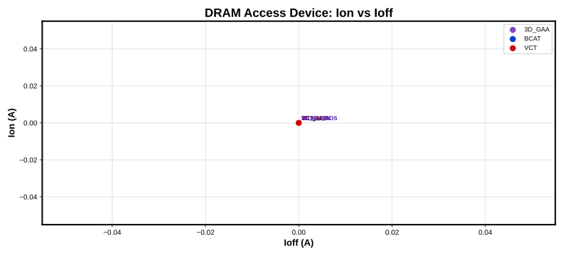

#### VCT node scaling


#### Composite figure of merit


#### 1T1C read time vs Ccell


---

## Suite: sense_amp

Detail report: [sense_amp/RESULTS.md](sense_amp/RESULTS.md)

### Read-Path Signal & SA Requirement Sweep

**Generated:** 2026-06-23 16:05 UTC  
**Corner:** tt  
**Simulator:** spectre  
**Signal rows:** 84  
**Models:** 7

### Scope (read this first)

| Measured in SPICE | Derived via behavioral SA sweep |
|-------------------|----------------------------------|
| ΔV_BL(t) on the read column | Min gain **G**, max offset **σ_os**, earliest **t_en** |
| Access device from OpenDRAM cards (`l`, `nfin`) | 99.9% yield **proxy** (not foundry MC) |
| Ccell, BL RC (pitch-scaled), WL / precharge timing | Input-referred read **budget** per model |

**Not in scope:** sense-amplifier transistor netlists, W/L sizing, layout mismatch, or SA bench scores.
The lane benchmarks **bitline signal development** and maps it to **SA specification tables** for co-design.

### Executive summary

- **SA closure @ 20 fF:** 7 / 7 access models meet the behavioral yield proxy at the reference point.
- **Tightest read budget:** `3D_gaa_AOS` needs ≥ 3.3 mV input-referred |ΔV_BL|.
- **Most margin:** `3D_gaa_AOS` closes with ≥ 3.3 mV input-referred |ΔV_BL|.
- **Co-design pass rate:** 81.9% of G×σ_os×t_en points exceed 99.9% yield proxy.
- **Downstream:** `ccell` consumes `read_signal_*.csv` when present; otherwise analytic read fallback.

### Behavioral SA assumptions

| Parameter | Value |
|-----------|-------|
| Gain sweep G | 5.0, 10.0, 20.0 |
| Offset tiers σ_os | 5, 10, 15, 20 mV |
| Output margin m_min | 50.0 mV |
| Target yield proxy | 99.9% |
| Margin model | M = G·|ΔV_BL| − |V_os|; pass if M > m_min |

### Read signal @ reference point

Reference: **Ccell = 20 fF**, **VBL_pre = 50% × Vdd** (compare access nodes at equal array loading).

|ΔV_BL| is the absolute differential BL voltage sampled from SPICE (access device + lumped BL RC + cell cap).

| model_id | |ΔV|@5ns_mV | |ΔV|@8ns_mV | |ΔV|@10ns_mV | |ΔV|@12ns_mV | |ΔV|@15ns_mV |
| --- | --- | --- | --- | --- | --- |
| 3D_gaa_Si | 29.06 | 46.37 | 54.28 | 60.35 | 67.16 |
| 3D_gaa_AOS | 15.95 | 23.42 | 26.44 | 28.54 | 30.61 |
| VCT_125 | 12.63 | 19.42 | 22.39 | 24.64 | 27.16 |
| VCT_102 | 9.35 | 14.76 | 17.25 | 19.19 | 21.43 |
| VCT_091 | 8.959 | 14.29 | 16.78 | 18.73 | 20.99 |
| VCT_082 | 8.66 | 13.92 | 16.4 | 18.35 | 20.63 |
| BCAT_125 | 5.407 | 10.09 | 12.85 | 15.37 | 18.74 |

### Per-node SA requirements (derived, not sized)

These rows answer: *what behavioral SA spec closes read at the reference point?* They are **requirements**, not transistor W/L or a benchmark score for a physical SA.

| model_id | status | read_guidance |
| --- | --- | --- |
| 3D_gaa_AOS | PASS | Sense by **5 ns** with G ≥ **10**, σ_os ≤ **20 mV** |
| 3D_gaa_Si | PASS | Sense by **5 ns** with G ≥ **5**, σ_os ≤ **20 mV** |
| BCAT_125 | PASS | Sense by **5 ns** with G ≥ **20**, σ_os ≤ **15 mV** |
| VCT_082 | PASS | Sense by **5 ns** with G ≥ **20**, σ_os ≤ **20 mV** |
| VCT_091 | PASS | Sense by **5 ns** with G ≥ **20**, σ_os ≤ **20 mV** |
| VCT_102 | PASS | Sense by **5 ns** with G ≥ **20**, σ_os ≤ **20 mV** |
| VCT_125 | PASS | Sense by **5 ns** with G ≥ **10**, σ_os ≤ **20 mV** |

| model_id | ccell_ff | max_sigma_os_mv | min_gain | earliest_t_en_ns | recommended_vbl_pre_fraction | min_delta_v_bl_mv | status |
| --- | --- | --- | --- | --- | --- | --- | --- |
| 3D_gaa_AOS | 20 | 20 | 10 | 5 | 0.5 | 3.323 | PASS |
| 3D_gaa_Si | 20 | 20 | 5 | 5 | 0.5 | 3.323 | PASS |
| BCAT_125 | 20 | 15 | 20 | 5 | 0.5 | 3.323 | PASS |
| VCT_082 | 20 | 20 | 20 | 5 | 0.5 | 3.323 | PASS |
| VCT_091 | 20 | 20 | 20 | 5 | 0.5 | 3.323 | PASS |
| VCT_102 | 20 | 20 | 20 | 5 | 0.5 | 3.323 | PASS |
| VCT_125 | 20 | 20 | 10 | 5 | 0.5 | 3.323 | PASS |

### Co-design sweep (yield proxy)

Points meeting 99.9% analytic yield: **344 / 420** across G × σ_os × t_en × model.

Sample of passing combinations (earliest t_en per model preferred):

| model_id | ccell_ff | vbl_pre_fraction | gain | sigma_os_mv | t_en_ns | delta_v_bl_v | delta_v_bl_mv | yield_fraction | passes_target | t_en_min_ns | min_delta_v_mv |
| --- | --- | --- | --- | --- | --- | --- | --- | --- | --- | --- | --- |
| 3D_gaa_AOS | 20 | 0.5 | 5 | 5 | 5 | 0.01595 | 15.95 | 1 | True | 5 | 13.29 |
| 3D_gaa_AOS | 20 | 0.5 | 10 | 5 | 5 | 0.01595 | 15.95 | 1 | True | 5 | 6.645 |
| 3D_gaa_AOS | 20 | 0.5 | 20 | 5 | 5 | 0.01595 | 15.95 | 1 | True | 5 | 3.323 |
| 3D_gaa_AOS | 20 | 0.5 | 10 | 10 | 5 | 0.01595 | 15.95 | 1 | True | 5 | 8.291 |
| 3D_gaa_AOS | 20 | 0.5 | 20 | 10 | 5 | 0.01595 | 15.95 | 1 | True | 5 | 4.145 |
| 3D_gaa_AOS | 20 | 0.5 | 10 | 15 | 5 | 0.01595 | 15.95 | 1 | True | 5 | 9.936 |
| 3D_gaa_AOS | 20 | 0.5 | 20 | 15 | 5 | 0.01595 | 15.95 | 1 | True | 5 | 4.968 |
| 3D_gaa_AOS | 20 | 0.5 | 10 | 20 | 5 | 0.01595 | 15.95 | 1 | True | 5 | 11.58 |
| 3D_gaa_AOS | 20 | 0.5 | 20 | 20 | 5 | 0.01595 | 15.95 | 1 | True | 5 | 5.791 |
| 3D_gaa_AOS | 20 | 0.5 | 5 | 5 | 8 | 0.02342 | 23.42 | 1 | True | 5 | 13.29 |
| 3D_gaa_AOS | 20 | 0.5 | 10 | 5 | 8 | 0.02342 | 23.42 | 1 | True | 5 | 6.645 |
| 3D_gaa_AOS | 20 | 0.5 | 20 | 5 | 8 | 0.02342 | 23.42 | 1 | True | 5 | 3.323 |
| 3D_gaa_AOS | 20 | 0.5 | 5 | 10 | 8 | 0.02342 | 23.42 | 1 | True | 8 | 16.58 |
| 3D_gaa_AOS | 20 | 0.5 | 10 | 10 | 8 | 0.02342 | 23.42 | 1 | True | 5 | 8.291 |
| 3D_gaa_AOS | 20 | 0.5 | 20 | 10 | 8 | 0.02342 | 23.42 | 1 | True | 5 | 4.145 |
| 3D_gaa_AOS | 20 | 0.5 | 5 | 15 | 8 | 0.02342 | 23.42 | 1 | True | 8 | 19.87 |
| 3D_gaa_AOS | 20 | 0.5 | 10 | 15 | 8 | 0.02342 | 23.42 | 1 | True | 5 | 9.936 |
| 3D_gaa_AOS | 20 | 0.5 | 20 | 15 | 8 | 0.02342 | 23.42 | 1 | True | 5 | 4.968 |
| 3D_gaa_AOS | 20 | 0.5 | 5 | 20 | 8 | 0.02342 | 23.42 | 0.9992 | True | 8 | 23.16 |
| 3D_gaa_AOS | 20 | 0.5 | 10 | 20 | 8 | 0.02342 | 23.42 | 1 | True | 5 | 11.58 |
| 3D_gaa_AOS | 20 | 0.5 | 20 | 20 | 8 | 0.02342 | 23.42 | 1 | True | 5 | 5.791 |
| 3D_gaa_AOS | 20 | 0.5 | 5 | 5 | 10 | 0.02644 | 26.44 | 1 | True | 5 | 13.29 |
| 3D_gaa_AOS | 20 | 0.5 | 10 | 5 | 10 | 0.02644 | 26.44 | 1 | True | 5 | 6.645 |
| 3D_gaa_AOS | 20 | 0.5 | 20 | 5 | 10 | 0.02644 | 26.44 | 1 | True | 5 | 3.323 |

### How to analyze the CSVs

#### `read_signal_<corner>.csv`

| Column | Meaning |
|--------|---------|
| `model_id` | OpenDRAM access card |
| `ccell_ff` | Cell capacitance (fF) |
| `vbl_pre_fraction` | BL precharge as fraction of Vdd |
| `dv_<t>ns` | |ΔV_BL| at sample time (V) — **primary SPICE output** |

#### `sa_spec_per_node.csv`

| Column | Meaning |
|--------|---------|
| `min_gain` | Smallest G in sweep that passes yield proxy |
| `max_sigma_os_mv` | Largest σ_os tier that still passes |
| `earliest_t_en_ns` | Earliest sense-enable time that passes |
| `min_delta_v_bl_mv` | Input-referred signal budget for target yield |
| `status` | PASS if any sweep point meets target |

#### `codesign_sweep.csv`

Full factorial of model × G × σ_os × t_en with `yield_fraction` and `passes_target`.
Use this to explore timing vs offset tradeoffs beyond the per-node summary.

### Figures

#### Dv Vs Time

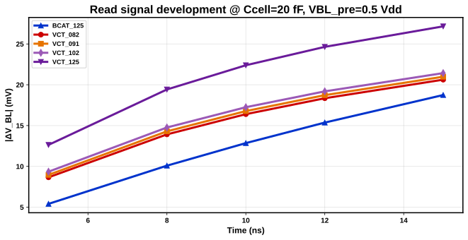

#### Dv Vs Ccell

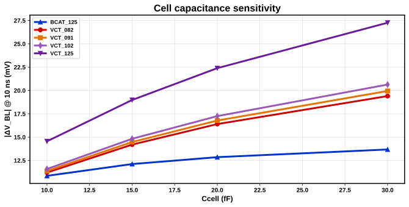

#### Yield Vs Ten

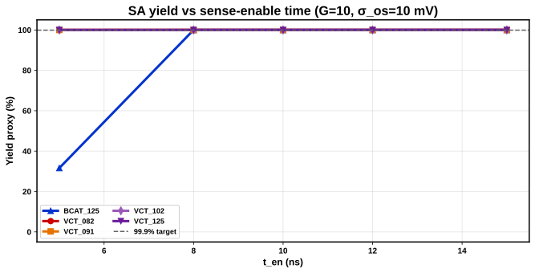

#### Min Dv Requirement

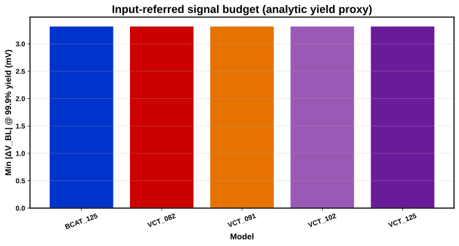

### Artifact index

| File | Contents |
|------|----------|
| `read_signal_tt.csv` | ΔV_BL samples: model × Ccell × VBL_pre |
| `codesign_sweep.csv` | G × σ_os × t_en yield proxy per model |
| `sa_spec_per_node.csv` | Min G, max σ_os, earliest t_en @ reference Ccell |
| `coupling_margin.csv` | ΔV loss vs k_couple (if coupling decks ran) |
| `figures/` | Summary SVG plots |

---
*Produced by `dram-sense-amp` / `dram-bench run --suite sense_amp`*

---

## Suite: ccell

Detail report: [ccell/RESULTS.md](ccell/RESULTS.md)

### OpenDRAM Cell Capacitance Roadmap

_Generated: 2026-06-23 16:04 UTC · revision `416f124`_

### Executive summary

- **Ccell sweep:** 504 rows across 7 models, Ccell ∈ {5, 8, 10, 15, 20, 25, 30, 40, 50, 60, 70, 80} fF.
- **Retention corner:** hot @ 64 ms target (ΔV = 50 mV loss).
- **Read corner:** tt @ SA input budget @ 99.9% yield (5.0–23.2 mV per model), t_en = 10 ns.

### Ccell_min table (dual constraint)

| Model | Arch | Ccell_min ret (fF) | Ccell_min read (fF) | Ccell_min (fF) | Binding | Cap-limited |
| --- | --- | --- | --- | --- | --- | --- |
| 3D_gaa_AOS | 3D_GAA | — | 5.9 | 5.9 | read-limited | False |
| 3D_gaa_Si | 3D_GAA | — | 5.0 | 5.0 | read-limited | True |
| BCAT_125 | BCAT | 103.3 | 5.0 | 103.3 | retention-limited | True |
| VCT_082 | VCT | — | 5.0 | 5.0 | read-limited | False |
| VCT_091 | VCT | — | 5.0 | 5.0 | read-limited | False |
| VCT_102 | VCT | — | 5.0 | 5.0 | read-limited | False |
| VCT_125 | VCT | — | 6.6 | 6.6 | read-limited | False |

### Binding classification

- **read-limited:** 6 models (3D_gaa_AOS, 3D_gaa_Si, VCT_082, VCT_091, VCT_102, VCT_125)
- **retention-limited:** 1 models (BCAT_125)

### Dielectric k scenario feasibility

#### S-aggressive

| Model | k | Achievable (fF) | Required (fF) | Cap-limited |
| --- | --- | --- | --- | --- |
| 3D_gaa_AOS | 40 | 42.5 | 5.9 | False |
| 3D_gaa_Si | 40 | 5.7 | 5.0 | False |
| BCAT_125 | 40 | 28.1 | 103.3 | True |
| VCT_082 | 22 | 18.7 | 5.0 | False |
| VCT_091 | 28 | 23.8 | 5.0 | False |
| VCT_102 | 34 | 28.9 | 5.0 | False |
| VCT_125 | 40 | 34.0 | 6.6 | False |
_Cap-limited under S-aggressive: BCAT_125_

#### S-base

| Model | k | Achievable (fF) | Required (fF) | Cap-limited |
| --- | --- | --- | --- | --- |
| 3D_gaa_AOS | 25 | 26.6 | 5.9 | False |
| 3D_gaa_Si | 25 | 3.6 | 5.0 | True |
| BCAT_125 | 25 | 17.6 | 103.3 | True |
| VCT_082 | 18 | 15.3 | 5.0 | False |
| VCT_091 | 20 | 17.0 | 5.0 | False |
| VCT_102 | 22 | 18.7 | 5.0 | False |
| VCT_125 | 25 | 21.3 | 6.6 | False |
_Cap-limited under S-base: 3D_gaa_Si, BCAT_125_

#### S-conservative

| Model | k | Achievable (fF) | Required (fF) | Cap-limited |
| --- | --- | --- | --- | --- |
| 3D_gaa_AOS | 18 | 19.1 | 5.9 | False |
| 3D_gaa_Si | 18 | 2.6 | 5.0 | True |
| BCAT_125 | 18 | 12.7 | 103.3 | True |
| VCT_082 | 15 | 12.8 | 5.0 | False |
| VCT_091 | 16 | 13.6 | 5.0 | False |
| VCT_102 | 17 | 14.5 | 5.0 | False |
| VCT_125 | 18 | 15.3 | 6.6 | False |
_Cap-limited under S-conservative: 3D_gaa_Si, BCAT_125_


### 3D vertical capacitor boost

| Model | β | Effective Ccell (fF) | Required (fF) | Feasible |
| --- | --- | --- | --- | --- |
| 3D_gaa_Si | 1.0 | 3.6 | 5.0 | False |
| 3D_gaa_Si | 1.5 | 5.4 | 5.0 | True |
| 3D_gaa_Si | 2.0 | 7.1 | 5.0 | True |
| 3D_gaa_Si | 2.5 | 8.9 | 5.0 | True |
| 3D_gaa_AOS | 1.0 | 26.6 | 5.9 | True |
| 3D_gaa_AOS | 1.5 | 39.8 | 5.9 | True |
| 3D_gaa_AOS | 2.0 | 53.1 | 5.9 | True |
| 3D_gaa_AOS | 2.5 | 66.4 | 5.9 | True |

### Device leakage what-if

| Model | Ioff scale | Ccell_min (fF) | ΔCcell_min (fF) |
| --- | --- | --- | --- |
| 3D_gaa_AOS | 1.00 | 5.9 | 0.0 |
| 3D_gaa_AOS | 0.50 | 5.9 | 0.0 |
| 3D_gaa_Si | 1.00 | 5.0 | 0.0 |
| 3D_gaa_Si | 0.50 | 5.0 | 0.0 |
| BCAT_125 | 1.00 | 103.3 | 0.0 |
| BCAT_125 | 0.50 | 51.6 | 51.7 |
| VCT_082 | 1.00 | 5.0 | 0.0 |
| VCT_082 | 0.50 | 5.0 | 0.0 |
| VCT_091 | 1.00 | 5.0 | 0.0 |
| VCT_091 | 0.50 | 5.0 | 0.0 |
| VCT_102 | 1.00 | 5.0 | 0.0 |
| VCT_102 | 0.50 | 5.0 | 0.0 |
| VCT_125 | 1.00 | 6.6 | 0.0 |
| VCT_125 | 0.50 | 6.6 | 0.0 |

### Figures

#### ccell min roadmap

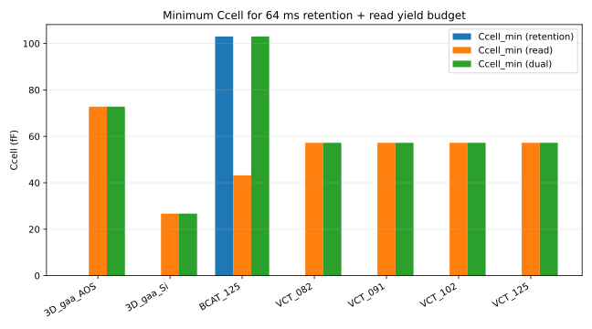

#### dv read vs ccell tt

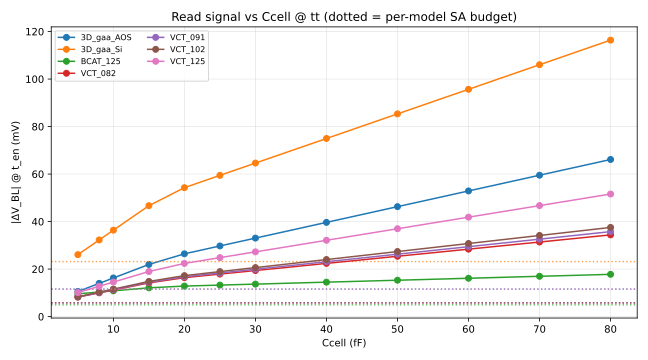

#### feasibility S-aggressive

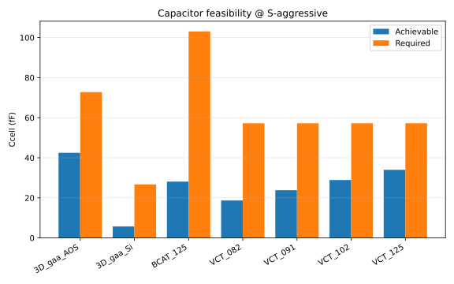

#### feasibility S-base

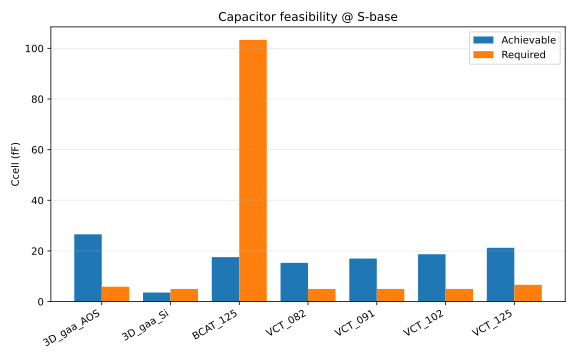

#### feasibility S-conservative

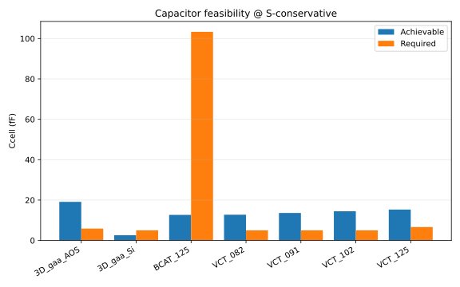

#### t ret vs ccell hot

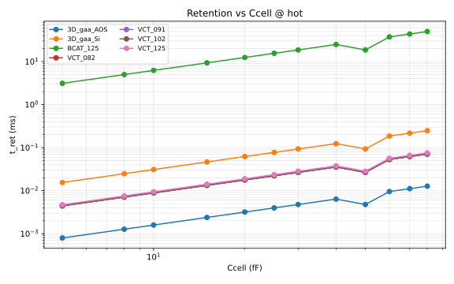

### Methodology

- Retention and read decks reuse OpenDRAM-pareto-roadmap and OpenDRAM-sense-amp-vct pipelines.
- Geometric capacitor model: Ccell = k·ε₀·α·structure·fpitch² / t_EOT · β with t_EOT = 1.5 nm.
- See [docs/ccell_metric_spec.md](../docs/ccell_metric_spec.md).

---

## Suite: validation

Detail report: [validation/RESULTS.md](validation/RESULTS.md)

### OpenDRAM Validation Summary

**Status:** PASS — 8/8 models pass, 0 trend violation(s)

- **Generated:** 2026-06-23 16:04 UTC
- **Model SHA:** `e692790da857`
- **Corner:** TT (27 °C)
- **Pinned metrics:** `bench/validation/pinned/` (TT corner)

### Executive summary

All golden YAML tolerance bands and declared VCT trends are satisfied against pinned SPICE-extracted metrics.

### 1. Model validation status

| Model | Architecture | Status | Errors |
| --- | --- | --- | --- |
| BCAT_125 | BCAT | PASS | 0 |
| VCT_082 | VCT | PASS | 0 |
| VCT_091 | VCT | PASS | 0 |
| VCT_102 | VCT | PASS | 0 |
| VCT_125 | VCT | PASS | 0 |
| 3D_gaa_Si | 3D_GAA | PASS | 0 |
| 3D_gaa_AOS | 3D_GAA | PASS | 0 |
| hv_peri_28_32 | HV_PERI | PASS | 0 |

#### Validation error count per model

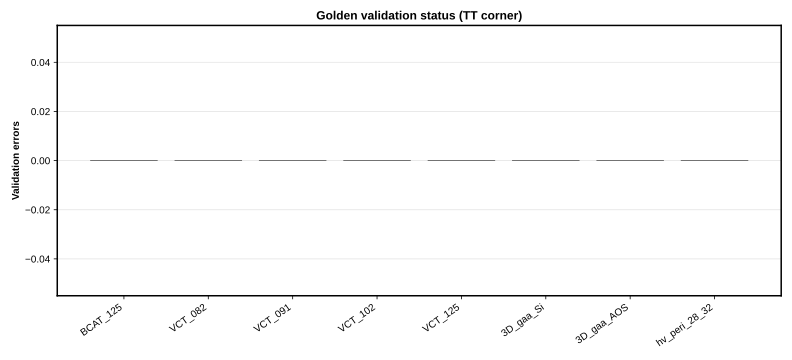

*Figure: `figures/validation_status.svg`*

### 2. Golden metric margins

Relative margin = (observed − golden) / golden × 100% for metrics with a reference value.

| Model | Metric | Conf. | Golden | Observed | Margin % | Status |
| --- | --- | --- | --- | --- | --- | --- |
| BCAT_125 | Ion | high | 3.024e-07 | 3.024e-07 | 0.0 | PASS |
| BCAT_125 | Ioff | high | 6.143e-14 | 6.143e-14 | 0.0 | PASS |
| BCAT_125 | fpitch | high | 4.200e-08 | 4.200e-08 | 0.0 | PASS |
| BCAT_125 | Ron | medium | 2.811e+06 | 2.811e+06 | 0.0 | PASS |
| BCAT_125 | Cgg | medium | 4.726e-17 | 4.726e-17 | 0.0 | PASS |
| VCT_082 | Ion | high | 8.620e-06 | 9.285e-07 | -89.2 | PASS |
| VCT_082 | Ioff | high | — | 3.731e-12 | — | PASS |
| VCT_082 | fpitch | high | 6.000e-08 | 6.000e-08 | 0.0 | PASS |
| VCT_082 | Ron | medium | 9.693e+05 | 9.693e+05 | 0.0 | PASS |
| VCT_082 | Cgg | medium | 1.216e-17 | 1.216e-17 | 0.0 | PASS |
| VCT_091 | Ion | high | 9.742e-07 | 9.742e-07 | 0.0 | PASS |
| VCT_091 | Ioff | high | 3.877e-12 | 3.877e-12 | 0.0 | PASS |
| VCT_091 | fpitch | high | 6.000e-08 | 6.000e-08 | 0.0 | PASS |
| VCT_091 | Ron | medium | 9.238e+05 | 9.238e+05 | 0.0 | PASS |
| VCT_091 | Cgg | medium | 1.217e-17 | 1.217e-17 | 0.0 | PASS |
| VCT_102 | Ion | high | 1.035e-06 | 1.035e-06 | 0.0 | PASS |
| VCT_102 | Ioff | high | 4.067e-12 | 4.067e-12 | 0.0 | PASS |
| VCT_102 | fpitch | high | 6.000e-08 | 6.000e-08 | 0.0 | PASS |
| VCT_102 | Ron | medium | 8.695e+05 | 8.695e+05 | 0.0 | PASS |
| VCT_102 | Cgg | medium | 1.219e-17 | 1.219e-17 | 0.0 | PASS |
| VCT_125 | fpitch | high | 6.000e-08 | 6.000e-08 | 0.0 | PASS |
| VCT_125 | Ron | medium | 6.403e+05 | 6.403e+05 | 0.0 | PASS |
| VCT_125 | Cgg | medium | 1.244e-17 | 1.244e-17 | 0.0 | PASS |
| 3D_gaa_Si | Ion | high | 1.041e-06 | 1.041e-06 | 0.0 | PASS |
| 3D_gaa_Si | Ioff | high | 1.011e-14 | 1.011e-14 | 0.0 | PASS |
| 3D_gaa_Si | fpitch | high | 2.200e-08 | 2.200e-08 | 0.0 | PASS |
| 3D_gaa_Si | Ron | medium | 7.207e+05 | 7.207e+05 | 0.0 | PASS |
| 3D_gaa_Si | Cgg | medium | 1.663e-16 | 1.663e-16 | 0.0 | PASS |
| 3D_gaa_AOS | Ion | high | 1.885e-06 | 1.885e-06 | 0.0 | PASS |
| 3D_gaa_AOS | Ioff | high | 8.455e-11 | 8.455e-11 | 0.0 | PASS |
| 3D_gaa_AOS | fpitch | high | 6.000e-08 | 6.000e-08 | 0.0 | PASS |
| 3D_gaa_AOS | Ron | medium | 3.978e+05 | 3.978e+05 | 0.0 | PASS |
| 3D_gaa_AOS | Cgg | medium | 7.082e-17 | 7.082e-17 | 0.0 | PASS |

#### Signed margin vs golden reference

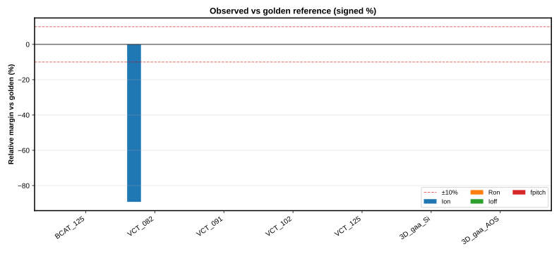

*Figure: `figures/golden_margins.svg`*

### 3. Roadmap trends

| Metric | Direction | Models | Status |
| --- | --- | --- | --- |
| Ion | increasing | VCT_082,VCT_091,VCT_102,VCT_125 | PASS |
| Ioff | non_decreasing | VCT_082,VCT_091,VCT_102,VCT_125 | PASS |

#### VCT Ion / Ioff / Ron scaling

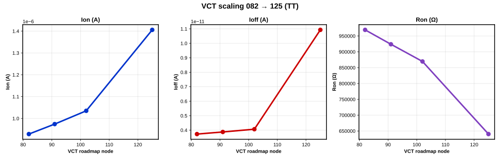

*Figure: `figures/vct_scaling.svg`*

### 4. Literature correlation

| Model | Metric | Open value | Literature band | Dir | Mag |
| --- | --- | --- | --- | --- | --- |
| BCAT_125 | fpitch | 42 | [38.0, 52.0] nm | True | H |
| BCAT_125 | Vdd | 0.85 | [0.85, 1.0] V | True | H |
| BCAT_125 | Ion | 3.024e-07 | directional (VCT Ion increases 082→125) | True | M |
| VCT_082 | fpitch | 60 | [38.0, 52.0] nm | True | L |
| VCT_082 | Vdd | 0.9 | [0.85, 1.0] V | True | H |
| VCT_082 | Ion | 9.285e-07 | directional (VCT Ion increases 082→125) | True | M |
| VCT_091 | fpitch | 60 | [38.0, 52.0] nm | True | L |
| VCT_091 | Vdd | 0.9 | [0.85, 1.0] V | True | H |
| VCT_091 | Ion | 9.742e-07 | directional (VCT Ion increases 082→125) | True | M |
| VCT_102 | fpitch | 60 | [38.0, 52.0] nm | True | L |
| VCT_102 | Vdd | 0.9 | [0.85, 1.0] V | True | H |
| VCT_102 | Ion | 1.035e-06 | directional (VCT Ion increases 082→125) | True | M |
| VCT_125 | fpitch | 60 | [38.0, 52.0] nm | True | L |
| VCT_125 | Vdd | 0.9 | [0.85, 1.0] V | True | H |
| VCT_125 | Ion | 1.406e-06 | directional (VCT Ion increases 082→125) | True | M |
| 3D_gaa_Si | fpitch | 22 | [38.0, 52.0] nm | True | L |
| 3D_gaa_Si | Vdd | 0.75 | [0.85, 1.0] V | True | L |
| 3D_gaa_Si | Ion | 1.041e-06 | directional (VCT Ion increases 082→125) | True | M |
| 3D_gaa_AOS | fpitch | 60 | [38.0, 52.0] nm | True | L |
| 3D_gaa_AOS | Vdd | 0.75 | [0.85, 1.0] V | True | L |
| 3D_gaa_AOS | Ion | 1.885e-06 | directional (VCT Ion increases 082→125) | True | M |

#### Pitch and Vdd vs public roadmap

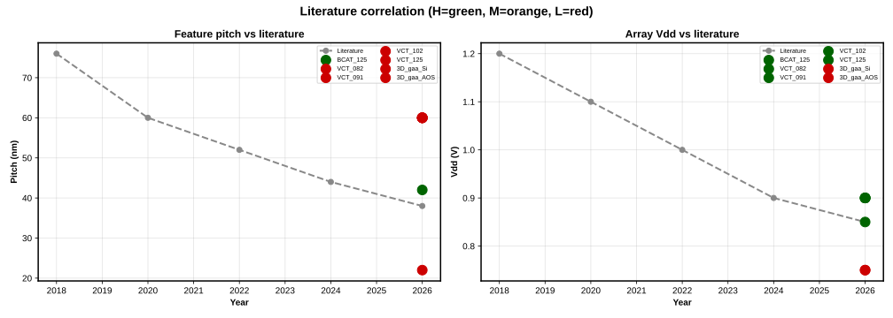

*Figure: `figures/literature_correlation.svg`*

### 5. Confidence tiers

| Tier | Meaning |
|------|---------|
| H | High — literature or PDK number, ±5–10% |
| M | Medium — inferred scaling, ±20% envelope |
| L | Low — extrapolated / directional only |

#### H/M/L metric count per model

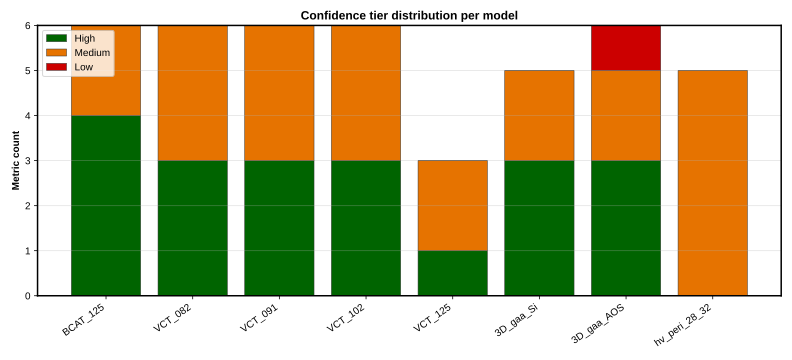

*Figure: `figures/confidence_tiers.svg`*

#### Cross-architecture normalized comparison

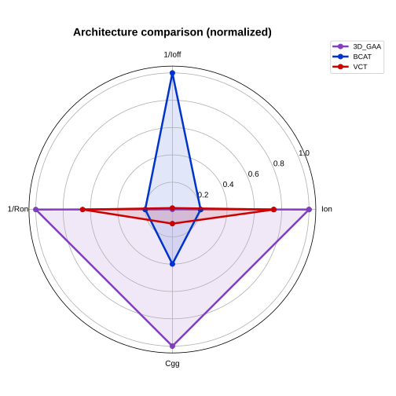

*Figure: `figures/architecture_radar.svg`*

### 6. Local sensitivity (OAT ±5%)

Top parameters by abs Δi_hold from cached local OAT sensitivity screen.

| Model | Parameter | abs Δ | Nominal |
| --- | --- | --- | --- |
| 3D_gaa_AOS | agidl | 0.1500 | 0.001 |
| VCT_125 | agidl | 0.1480 | 0.0002 |
| BCAT_125 | agidl | 0.0860 | 0.0001 |

#### OAT sensitivity — i_hold

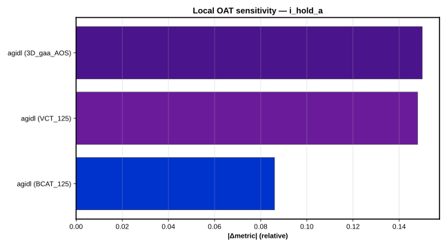

*Figure: `figures/sensitivity_oat_ihold.svg`*

#### OAT sensitivity — Ion

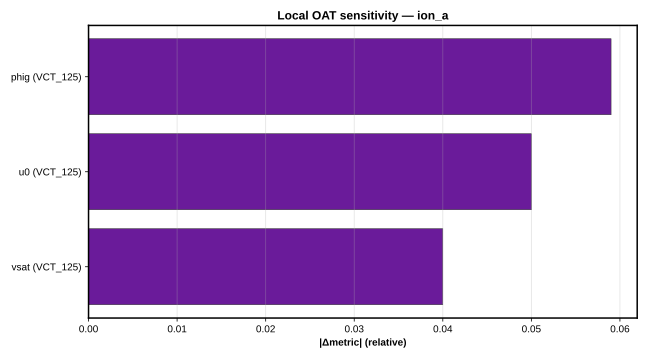

*Figure: `figures/sensitivity_oat_ion.svg`*

### 7. Pinned device metrics (TT)

| Model | Arch. | Vdd (V) | Ion (A) | Ioff (A) | Ron (Ω) | fpitch (m) |
| --- | --- | --- | --- | --- | --- | --- |
| BCAT_125 | BCAT | 0.85 | 3.024e-07 | 6.143e-14 | 2.811e+06 | 4.20e-08 |
| VCT_082 | VCT | 0.90 | 9.285e-07 | 3.731e-12 | 9.693e+05 | 6.00e-08 |
| VCT_091 | VCT | 0.90 | 9.742e-07 | 3.877e-12 | 9.238e+05 | 6.00e-08 |
| VCT_102 | VCT | 0.90 | 1.035e-06 | 4.067e-12 | 8.695e+05 | 6.00e-08 |
| VCT_125 | VCT | 0.90 | 1.406e-06 | 1.093e-11 | 6.403e+05 | 6.00e-08 |
| 3D_gaa_Si | 3D_GAA | 0.75 | 1.041e-06 | 1.011e-14 | 7.207e+05 | 2.20e-08 |
| 3D_gaa_AOS | 3D_GAA | 0.75 | 1.885e-06 | 8.455e-11 | 3.978e+05 | 6.00e-08 |

### 8. Pinned 1T1C metrics (20 fF, TT)

| Model | t_read (s) | t_write (s) | I_hold (A) |
| --- | --- | --- | --- |
| BCAT_125 | 2.272e-08 | 1.900e-09 | 8.384e-14 |
| VCT_082 | 2.282e-08 | 1.900e-09 | 6.021e-11 |
| VCT_091 | 2.282e-08 | 1.900e-09 | 6.016e-11 |
| VCT_102 | 2.283e-08 | 1.900e-09 | 6.009e-11 |
| VCT_125 | 2.293e-08 | 1.900e-09 | 5.757e-11 |
| 3D_gaa_Si | 2.291e-08 | 1.900e-09 | 1.672e-11 |
| 3D_gaa_AOS | 2.257e-08 | 1.901e-09 | 3.455e-10 |

### 9. SPICE simulator cross-check (Spectre / HSPICE / ngspice)

Reference backend: **spectre** (tt corner). Relative Δ = (backend − reference) / reference.

| Backend | Pinned role | Host available |
| --- | --- | --- |
| spectre | reference | yes |
| hspice | compared | no |
| ngspice | compared | yes |

*Note:* Post-fix pin: HSPICE -inc, ngspice parser/measures

#### Max abs relative difference by metric

| Metric | Backend | max abs Δ | mean abs Δ |
| --- | --- | --- | --- |
| cgg_f | ngspice | 0.9925 | 0.9382 |
| ioff_a | hspice | 1.885 | 0.2693 |
| ioff_a | ngspice | 1.885 | 1.059 |
| ion_a | hspice | 0.7154 | 0.1022 |
| ion_a | ngspice | 1.405 | 0.8461 |
| ron_ohm | ngspice | 0.9781 | 0.8783 |

#### Simulator agreement summary

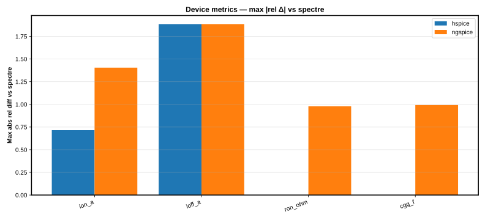

*Figure: `figures/simulator_max_rel_diff.svg`*

#### Per-model relative Δ heatmap

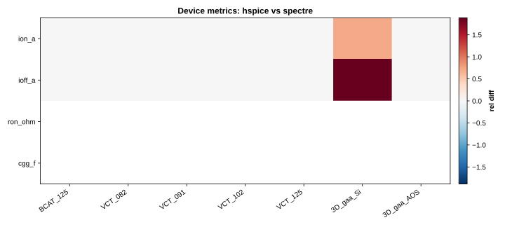

*Figure: `figures/simulator_rel_diff_heatmap.svg`*

#### Spectre vs alternate backend scatter

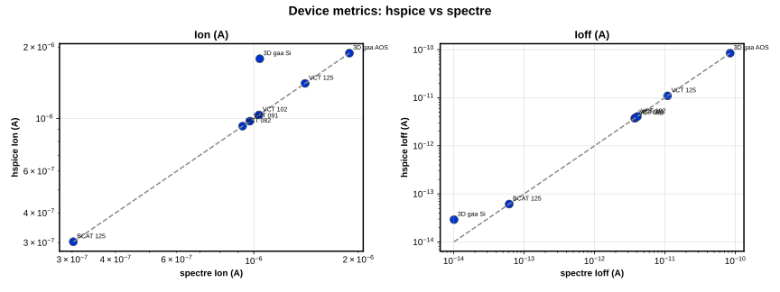

*Figure: `figures/simulator_spectre_vs_backend.svg`*

#### Per-model Ion / Ioff / Ron / Cgg vs Spectre

| Model | Metric | Backend | Rel Δ |
| --- | --- | --- | --- |
| 3D_gaa_AOS | cgg_f | ngspice | -0.9416 |
| 3D_gaa_AOS | ioff_a | hspice | 1.975e-08 |
| 3D_gaa_AOS | ioff_a | ngspice | -0.7481 |
| 3D_gaa_AOS | ion_a | hspice | 0 |
| 3D_gaa_AOS | ion_a | ngspice | 1.405 |
| 3D_gaa_AOS | ron_ohm | ngspice | -0.9409 |
| 3D_gaa_Si | cgg_f | ngspice | -0.9022 |
| 3D_gaa_Si | ioff_a | hspice | 1.885 |
| 3D_gaa_Si | ioff_a | ngspice | 1.885 |
| 3D_gaa_Si | ion_a | hspice | 0.7154 |
| 3D_gaa_Si | ion_a | ngspice | 0.7154 |
| 3D_gaa_Si | ron_ohm | ngspice | -0.9144 |
| BCAT_125 | cgg_f | ngspice | -0.7556 |
| BCAT_125 | ioff_a | hspice | -1.374e-07 |
| BCAT_125 | ioff_a | ngspice | -0.8586 |
| BCAT_125 | ion_a | hspice | 1.29e-09 |
| BCAT_125 | ion_a | ngspice | 0.8447 |
| BCAT_125 | ron_ohm | ngspice | -0.9415 |
| VCT_082 | cgg_f | ngspice | -0.9914 |
| VCT_082 | ioff_a | hspice | -2.68e-09 |
| VCT_082 | ioff_a | ngspice | -0.9841 |
| VCT_082 | ion_a | hspice | -2.477e-10 |
| VCT_082 | ion_a | ngspice | 0.7182 |
| VCT_082 | ron_ohm | ngspice | -0.7176 |
| VCT_091 | cgg_f | ngspice | -0.992 |
| VCT_091 | ioff_a | hspice | -2.58e-09 |
| VCT_091 | ioff_a | ngspice | -0.984 |
| VCT_091 | ion_a | hspice | -3.901e-10 |
| VCT_091 | ion_a | ngspice | 0.7241 |
| VCT_091 | ron_ohm | ngspice | -0.7901 |
| VCT_102 | cgg_f | ngspice | -0.9925 |
| VCT_102 | ioff_a | hspice | 0 |
| VCT_102 | ioff_a | ngspice | -0.9838 |
| VCT_102 | ion_a | hspice | 0 |
| VCT_102 | ion_a | ngspice | 0.732 |
| VCT_102 | ron_ohm | ngspice | -0.8656 |
| VCT_125 | cgg_f | ngspice | -0.9924 |
| VCT_125 | ioff_a | hspice | 4.575e-09 |
| VCT_125 | ioff_a | ngspice | -0.9693 |
| VCT_125 | ion_a | hspice | 0 |
| VCT_125 | ion_a | ngspice | 0.7834 |
| VCT_125 | ron_ohm | ngspice | -0.9781 |

#### 1T1C cell metrics (20 fF)

| Metric | Backend | max abs Δ | mean abs Δ |
| --- | --- | --- | --- |
| i_hold_a | hspice | 0.5638 | 0.1161 |
| i_hold_a | ngspice | 93.13 | 13.73 |
| t_read_s | hspice | 0.003388 | 0.001231 |
| t_read_s | ngspice | 0.007101 | 0.004778 |
| t_write_s | hspice | 2.319e-08 | 1.5e-08 |
| t_write_s | ngspice | 6.726e-05 | 4.359e-05 |

##### 1T1C simulator agreement

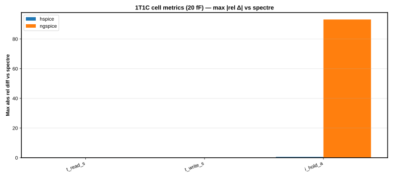

*Figure: `figures/simulator_cell_max_rel_diff.svg`*

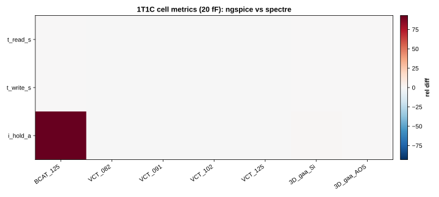

*Figure: `figures/simulator_cell_rel_diff_heatmap.svg`*

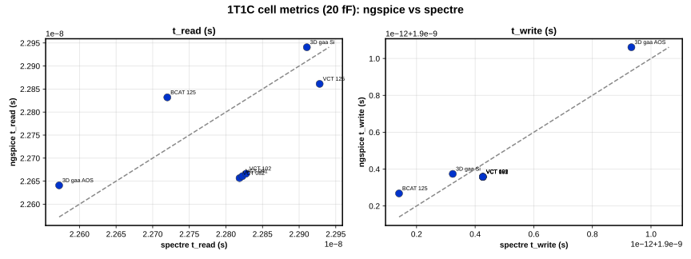

*Figure: `figures/simulator_cell_spectre_vs_backend.svg`*

##### Per-model 1T1C timing / hold vs Spectre

| Model | Metric | Backend | Rel Δ |
| --- | --- | --- | --- |
| 3D_gaa_AOS | i_hold_a | hspice | -0.01252 |
| 3D_gaa_AOS | i_hold_a | ngspice | 0.304 |
| 3D_gaa_AOS | t_read_s | hspice | 0.002392 |
| 3D_gaa_AOS | t_read_s | ngspice | 0.00304 |
| 3D_gaa_AOS | t_write_s | hspice | -2.301e-08 |
| 3D_gaa_AOS | t_write_s | ngspice | 6.726e-05 |
| 3D_gaa_Si | i_hold_a | hspice | -0.09985 |
| 3D_gaa_Si | i_hold_a | ngspice | 0.766 |
| 3D_gaa_Si | t_read_s | hspice | 0.003388 |
| 3D_gaa_Si | t_read_s | ngspice | 0.001318 |
| 3D_gaa_Si | t_write_s | hspice | 6.923e-09 |
| 3D_gaa_Si | t_write_s | ngspice | 2.654e-05 |
| BCAT_125 | i_hold_a | hspice | -0.5638 |
| BCAT_125 | i_hold_a | ngspice | 93.13 |
| BCAT_125 | t_read_s | hspice | 7.859e-06 |
| BCAT_125 | t_read_s | ngspice | 0.004928 |
| BCAT_125 | t_write_s | hspice | -1.206e-08 |
| BCAT_125 | t_write_s | ngspice | 6.722e-05 |
| VCT_082 | i_hold_a | hspice | -0.03013 |
| VCT_082 | i_hold_a | ngspice | -0.4743 |
| VCT_082 | t_read_s | hspice | 0.000525 |
| VCT_082 | t_read_s | ngspice | -0.007101 |
| VCT_082 | t_write_s | hspice | 1.327e-08 |
| VCT_082 | t_write_s | ngspice | -3.605e-05 |
| VCT_091 | i_hold_a | hspice | -0.02943 |
| VCT_091 | i_hold_a | ngspice | -0.474 |
| VCT_091 | t_read_s | hspice | 0.0005459 |
| VCT_091 | t_read_s | ngspice | -0.007086 |
| VCT_091 | t_write_s | hspice | 1.327e-08 |
| VCT_091 | t_write_s | ngspice | -3.605e-05 |
| VCT_102 | i_hold_a | hspice | -0.02858 |
| VCT_102 | i_hold_a | ngspice | -0.4737 |
| VCT_102 | t_read_s | hspice | 0.0005643 |
| VCT_102 | t_read_s | ngspice | -0.007063 |
| VCT_102 | t_write_s | hspice | 1.327e-08 |
| VCT_102 | t_write_s | ngspice | -3.605e-05 |
| VCT_125 | i_hold_a | hspice | -0.04811 |
| VCT_125 | i_hold_a | ngspice | -0.4674 |
| VCT_125 | t_read_s | hspice | 0.001195 |
| VCT_125 | t_read_s | ngspice | -0.002913 |
| VCT_125 | t_write_s | hspice | 2.319e-08 |
| VCT_125 | t_write_s | ngspice | -3.598e-05 |

#### Mini-array metrics

| Metric | Backend | max abs Δ | mean abs Δ |
| --- | --- | --- | --- |
| i_bl_leak_a | hspice | 0.1199 | 0.0182 |
| i_bl_leak_a | ngspice | 20.75 | 12.29 |
| t_bl_settle_s | hspice | 0.1845 | 0.028 |
| t_bl_settle_s | ngspice | 0.3954 | 0.3954 |

##### Mini-array simulator agreement

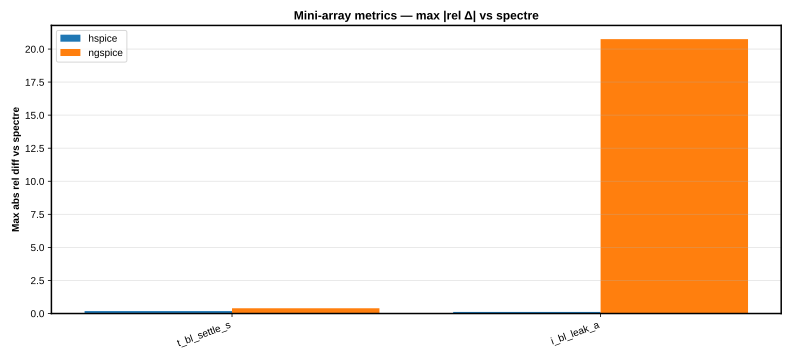

*Figure: `figures/simulator_mini_array_max_rel_diff.svg`*

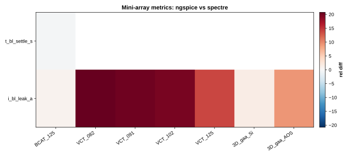

*Figure: `figures/simulator_mini_array_rel_diff_heatmap.svg`*

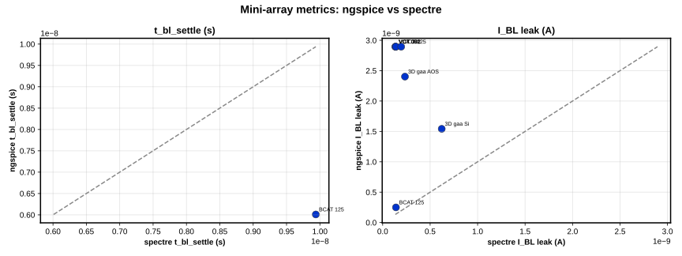

*Figure: `figures/simulator_mini_array_spectre_vs_backend.svg`*

##### Per-model mini-array vs Spectre

| Model | Metric | Backend | Rel Δ |
| --- | --- | --- | --- |
| 3D_gaa_AOS | i_bl_leak_a | hspice | 0.0003399 |
| 3D_gaa_AOS | i_bl_leak_a | ngspice | 9.233 |
| 3D_gaa_AOS | t_bl_settle_s | hspice | 0.003833 |
| 3D_gaa_Si | i_bl_leak_a | hspice | 0.1199 |
| 3D_gaa_Si | i_bl_leak_a | ngspice | 1.48 |
| 3D_gaa_Si | t_bl_settle_s | hspice | -0.1845 |
| BCAT_125 | i_bl_leak_a | hspice | 0.001944 |
| BCAT_125 | i_bl_leak_a | ngspice | 0.7838 |
| BCAT_125 | t_bl_settle_s | hspice | -0.003557 |
| BCAT_125 | t_bl_settle_s | ngspice | -0.3954 |
| VCT_082 | i_bl_leak_a | hspice | 0.001281 |
| VCT_082 | i_bl_leak_a | ngspice | 20.75 |
| VCT_082 | t_bl_settle_s | hspice | -0.0009534 |
| VCT_091 | i_bl_leak_a | hspice | 0.001276 |
| VCT_091 | i_bl_leak_a | ngspice | 20.26 |
| VCT_091 | t_bl_settle_s | hspice | -0.0003382 |
| VCT_102 | i_bl_leak_a | hspice | 0.00137 |
| VCT_102 | i_bl_leak_a | ngspice | 19.69 |
| VCT_102 | t_bl_settle_s | hspice | -0.001268 |
| VCT_125 | i_bl_leak_a | hspice | 0.001283 |
| VCT_125 | i_bl_leak_a | ngspice | 13.84 |
| VCT_125 | t_bl_settle_s | hspice | -0.001511 |

Regenerate pinned comparison:

```bash
dram-validate simulators --refresh
```

### Data files

| File | Description |
|------|-------------|
| [`data/cell_metrics_tt_20ff.csv`](validation/data/cell_metrics_tt_20ff.csv) | Pinned TT 1T1C metrics at 20 fF |
| [`data/correlation_matrix.csv`](validation/data/correlation_matrix.csv) | Literature alignment scores |
| [`data/device_metrics_tt.csv`](validation/data/device_metrics_tt.csv) | Pinned TT device metrics |
| [`data/metric_detail.csv`](validation/data/metric_detail.csv) | Full golden vs observed detail |
| [`data/model_summary.csv`](validation/data/model_summary.csv) | Per-model pass/fail summary |
| [`data/sensitivity_oat.csv`](validation/data/sensitivity_oat.csv) | Cached local OAT perturbation results |
| [`data/simulator_cell_detail.csv`](validation/data/simulator_cell_detail.csv) | Per-model 1T1C simulator metric deltas |
| [`data/simulator_cell_rel_diff.csv`](validation/data/simulator_cell_rel_diff.csv) | 1T1C cell metric rel differences across simulators (20 fF) |
| [`data/simulator_cell_summary.csv`](validation/data/simulator_cell_summary.csv) | Max abs 1T1C rel diff by metric and backend |
| [`data/simulator_cell_wide.csv`](validation/data/simulator_cell_wide.csv) | Per-simulator 1T1C metrics wide merge (20 fF) |
| [`data/simulator_device_detail.csv`](validation/data/simulator_device_detail.csv) | Per-model simulator metric deltas |
| [`data/simulator_device_rel_diff.csv`](validation/data/simulator_device_rel_diff.csv) | Spectre vs HSPICE/ngspice device rel differences |
| [`data/simulator_device_summary.csv`](validation/data/simulator_device_summary.csv) | Max abs rel diff by metric and backend |
| [`data/simulator_device_wide.csv`](validation/data/simulator_device_wide.csv) | Per-simulator device metrics (wide merge) |
| [`data/simulator_mini_array_detail.csv`](validation/data/simulator_mini_array_detail.csv) | Per-model mini-array simulator metric deltas |
| [`data/simulator_mini_array_rel_diff.csv`](validation/data/simulator_mini_array_rel_diff.csv) | Mini-array metric rel differences across simulators |
| [`data/simulator_mini_array_summary.csv`](validation/data/simulator_mini_array_summary.csv) | Max abs mini-array rel diff by metric and backend |
| [`data/simulator_mini_array_wide.csv`](validation/data/simulator_mini_array_wide.csv) | Per-simulator mini-array metrics wide merge |
| [`data/trend_detail.csv`](validation/data/trend_detail.csv) | Roadmap trend checks |

---

Regenerate: `dram-validate report` or `./run_validation.sh`

Model cards: `models/OpenDRAMmodelV1`

---

## Artifacts

| File | Description |
|------|-------------|
| [`MANIFEST.json`](MANIFEST.json) | Provenance manifest with SHA-256 checksums |
## Reproduce

```bash
./scripts/run_experiments.sh                    # default: full benchmark bundle
SUITE=device ./scripts/run_experiments.sh  # device lane only (faster)
dram-bench run --suite all --corner tt --output results
```

Metric definitions: [docs/benchmark_spec.md](../docs/benchmark_spec.md)

---
*Report produced by `dram-bench` / `run_experiments.sh`*